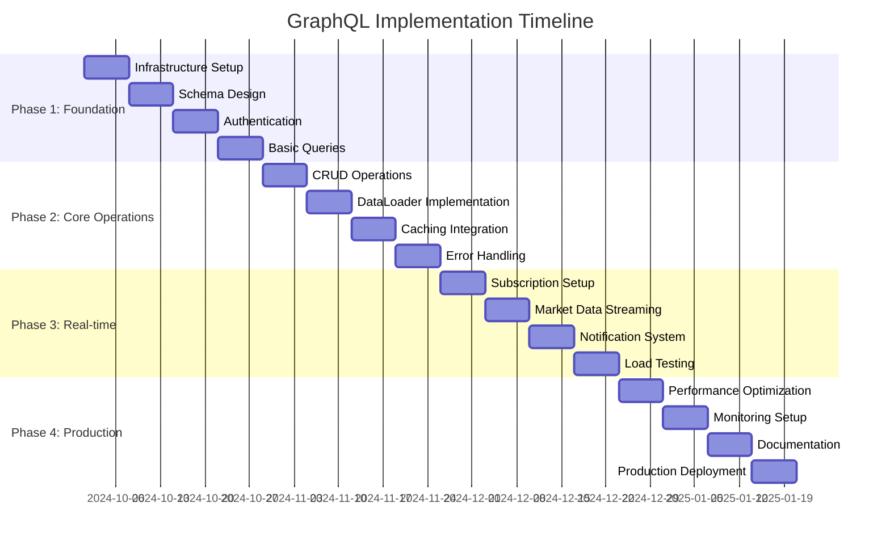

# 🚀 GraphQL Implementation Report - BIST Trading Platform

> **Report Version**: 1.0.0
> **Date**: 26 Eylül 2025
> **Author**: Development Team
> **Status**: 📋 **PLANNING PHASE**
> **Implementation Timeline**: 16-24 weeks
> **Strategic Priority**: **HIGH**

## 📋 Table of Contents

1. [Executive Summary](#1-executive-summary)
2. [Current REST API Analysis](#2-current-rest-api-analysis)
3. [GraphQL Schema Design](#3-graphql-schema-design)
4. [Technical Implementation Approach](#4-technical-implementation-approach)
5. [Security Integration](#5-security-integration)
6. [Performance & Caching Strategy](#6-performance--caching-strategy)
7. [Migration Strategy](#7-migration-strategy)
8. [Development Timeline](#8-development-timeline)
9. [Risk Assessment](#9-risk-assessment)
10. [Recommendations](#10-recommendations)

---

## 1. Executive Summary

### 1.1 Project Overview

The BIST Trading Platform currently implements a comprehensive REST API architecture across multiple microservices. This report evaluates the feasibility and benefits of implementing GraphQL as a unified data access layer while maintaining the existing microservices architecture.

**Key Findings:**
- ✅ **Strong Foundation**: Current REST APIs are well-structured with comprehensive OpenAPI documentation
- ✅ **Security Ready**: JWT authentication system can be seamlessly integrated with GraphQL
- ✅ **Performance Optimized**: Existing caching and TimescaleDB infrastructure supports GraphQL requirements
- ⚠️ **Complexity**: Migration requires careful planning to maintain system stability
- 🔄 **Hybrid Approach**: Recommended to implement GraphQL alongside REST for gradual migration

### 1.2 Business Value Proposition

| Benefit | Impact | Implementation Complexity |
|---------|--------|---------------------------|
| **Unified API Interface** | High - Simplified client development | Medium |
| **Reduced Over-fetching** | Medium - Improved mobile performance | Low |
| **Real-time Subscriptions** | High - Enhanced trading experience | High |
| **Type Safety** | High - Better developer experience | Low |
| **N+1 Query Elimination** | High - Improved backend performance | Medium |

---

## 2. Current REST API Analysis

### 2.1 Microservices API Overview

Based on the codebase analysis, the platform consists of the following REST APIs:

#### 2.1.1 User Management Service (`/api/v1/users`)
```yaml
Endpoints:
  - GET /profile                    # User profile management
  - PUT /profile                    # Profile updates
  - PUT /password                   # Password management
  - POST /verify-email              # Email verification
  - POST /verify-phone              # Phone verification
  - GET /sessions                   # Session management
  - DELETE /sessions/{sessionId}    # Session termination
  - POST /deactivate               # Account deactivation

Key Features:
  - TCKN validation for Turkish market
  - Multi-factor authentication
  - Session management
  - Comprehensive audit logging
```

#### 2.1.2 Order Management Service (`/api/v1/orders`)
```yaml
Endpoints:
  - GET /orders                     # Order listing with filters
  - POST /orders                    # Order placement
  - GET /{orderId}                  # Order details
  - PUT /{orderId}                  # Order modification
  - DELETE /{orderId}              # Order cancellation
  - GET /active                     # Active orders
  - GET /history                    # Order history
  - GET /statistics                 # Order statistics
  - POST /batch                     # Batch operations

Key Features:
  - Advanced filtering capabilities
  - HATEOAS support
  - Async order processing
  - Comprehensive validation
  - Turkish market compliance (BIST)
```

#### 2.1.3 Market Data Service (`/api/v1/market-data`)
```yaml
Endpoints:
  - GET /ohlcv/{symbol}            # Multi-timeframe OHLCV data
  - GET /volume/{symbol}           # Volume analysis
  - GET /technical/{symbol}        # Technical indicators
  - GET /trend/{symbol}            # Trend analysis
  - GET /orderbook/{symbol}        # Order book analysis
  - GET /microstructure/{symbol}   # Microstructure analysis
  - GET /overview                  # Market overview

Key Features:
  - TimescaleDB integration
  - Real-time analytics
  - Turkish market focus
  - Multi-timeframe support
  - Advanced technical analysis
```

#### 2.1.4 Broker Integration Service (`/api/v1/broker`)
```yaml
Endpoints:
  - POST /orders                    # Order placement via AlgoLab
  - PUT /orders/{orderId}          # Order modification
  - DELETE /orders/{orderId}       # Order cancellation
  - GET /portfolio                  # Portfolio positions
  - GET /transactions              # Transaction history
  - GET /positions                 # Real-time positions
  - GET /status                    # Broker connection status
  - GET /symbols                   # Available symbols

Key Features:
  - AlgoLab broker integration
  - Real-time position tracking
  - Turkish stock symbol support
  - Comprehensive error handling
```

### 2.2 API Gateway Architecture

The platform implements Spring Cloud Gateway with:
- **JWT Authentication**: Bearer token-based security
- **Rate Limiting**: Distributed rate limiting with Redis
- **Circuit Breakers**: Resilience4j integration
- **CORS Support**: Turkish domain whitelist
- **Monitoring**: Actuator endpoints with role-based access

### 2.3 Current Challenges

1. **API Fragmentation**: Clients must call multiple endpoints for complex operations
2. **Over-fetching**: REST endpoints return fixed data structures
3. **N+1 Problems**: Related data requires multiple API calls
4. **Real-time Limitations**: Limited WebSocket implementation
5. **Client Complexity**: Mobile apps need data transformation logic

---

## 3. GraphQL Schema Design

### 3.1 Core Schema Architecture

```graphql
# User Domain
type User {
  id: ID!
  username: String!
  email: String!
  profile: UserProfile!
  sessions: [UserSession!]!
  orders(filter: OrderFilter, pagination: Pagination): OrderConnection!
  portfolio: Portfolio!
  preferences: UserPreferences
}

type UserProfile {
  firstName: String!
  lastName: String!
  phoneNumber: String
  tcKimlik: String!
  status: UserStatus!
  emailVerified: Boolean!
  phoneVerified: Boolean!
  kycCompleted: Boolean!
  kycLevel: KYCLevel!
  riskProfile: RiskProfile!
  createdAt: DateTime!
  lastLoginAt: DateTime
}

# Order Domain
type Order {
  id: ID!
  clientOrderId: String
  user: User!
  symbol: String!
  side: OrderSide!
  type: OrderType!
  quantity: Decimal!
  price: Decimal
  stopPrice: Decimal
  status: OrderStatus!
  timeInForce: TimeInForce!
  fills: [OrderFill!]!
  marketData: MarketData
  createdAt: DateTime!
  updatedAt: DateTime!
}

type OrderConnection {
  edges: [OrderEdge!]!
  pageInfo: PageInfo!
  totalCount: Int!
  statistics: OrderStatistics
}

# Market Data Domain
type MarketData {
  symbol: String!
  currentPrice: Decimal
  lastUpdate: DateTime!
  ohlcv(timeframe: Timeframe!, period: DateRange!): [OHLCV!]!
  technicalIndicators(config: TechnicalConfig!): TechnicalAnalysis!
  volumeAnalysis(period: DateRange!): VolumeAnalysis!
  orderBook: OrderBookData
}

type OHLCV {
  timestamp: DateTime!
  open: Decimal!
  high: Decimal!
  low: Decimal!
  close: Decimal!
  volume: Decimal!
  vwap: Decimal
}

# Portfolio Domain
type Portfolio {
  user: User!
  totalValue: Decimal!
  totalCost: Decimal!
  totalPnl: Decimal!
  cashBalance: Decimal!
  positions: [Position!]!
  performance: PerformanceMetrics!
}

type Position {
  symbol: String!
  quantity: Decimal!
  averagePrice: Decimal!
  currentPrice: Decimal
  marketValue: Decimal!
  pnl: Decimal!
  pnlPercent: Decimal!
  marketData: MarketData
}

# Broker Integration
type BrokerStatus {
  connected: Boolean!
  authenticated: Boolean!
  lastCheckTime: DateTime!
  sessionExpiresAt: DateTime
  brokerName: String!
  capabilities: [BrokerCapability!]!
}
```

### 3.2 Query Operations

```graphql
type Query {
  # User Operations
  me: User
  user(id: ID!): User

  # Order Operations
  order(id: ID!): Order
  orders(filter: OrderFilter, pagination: Pagination): OrderConnection!
  orderStatistics(period: DateRange): OrderStatistics!

  # Market Data Operations
  marketData(symbol: String!): MarketData
  marketOverview(period: DateRange): MarketOverview!
  searchSymbols(query: String!, limit: Int): [Symbol!]!

  # Portfolio Operations
  portfolio: Portfolio!
  positions: [Position!]!
  transactions(filter: TransactionFilter): TransactionConnection!

  # Broker Operations
  brokerStatus: BrokerStatus!
  availableSymbols: [Symbol!]!
}
```

### 3.3 Mutation Operations

```graphql
type Mutation {
  # Order Management
  placeOrder(input: PlaceOrderInput!): Order!
  modifyOrder(id: ID!, input: ModifyOrderInput!): Order!
  cancelOrder(id: ID!): Order!
  batchOrders(input: BatchOrderInput!): BatchOrderResult!

  # User Management
  updateProfile(input: UpdateProfileInput!): User!
  changePassword(input: ChangePasswordInput!): Boolean!
  verifyEmail(code: String!): Boolean!
  verifyPhone(code: String!): Boolean!

  # Session Management
  terminateSession(sessionId: ID!): Boolean!
  terminateAllSessions: Int!
}
```

### 3.4 Subscription Operations

```graphql
type Subscription {
  # Real-time Market Data
  marketDataUpdates(symbols: [String!]!): MarketDataUpdate!
  priceUpdates(symbol: String!): PriceUpdate!

  # Order Updates
  orderUpdates(userId: ID): OrderUpdate!
  orderFills(userId: ID): OrderFill!

  # Portfolio Updates
  portfolioUpdates(userId: ID!): PortfolioUpdate!
  positionUpdates(userId: ID!, symbols: [String!]): PositionUpdate!

  # System Updates
  systemNotifications(userId: ID!): SystemNotification!
}
```

---

## 4. Technical Implementation Approach

### 4.1 Spring Boot GraphQL Integration

#### 4.1.1 Dependencies

```gradle
dependencies {
    // GraphQL Spring Boot Starter
    implementation 'org.springframework.boot:spring-boot-starter-graphql'

    // GraphQL Java Extended Scalars
    implementation 'com.graphql-java:graphql-java-extended-scalars:21.0'

    // GraphQL Java Tools (Schema First)
    implementation 'com.graphql-java-kickstart:graphql-spring-boot-starter:15.0.0'

    // Reactive Support
    implementation 'org.springframework.boot:spring-boot-starter-webflux'

    // Existing dependencies
    implementation 'org.springframework.boot:spring-boot-starter-data-jpa'
    implementation 'org.springframework.boot:spring-boot-starter-security'
    implementation 'org.springframework.boot:spring-boot-starter-data-redis'
}
```

#### 4.1.2 GraphQL Configuration

```java
@Configuration
@EnableGraphQLWebMvc
public class GraphQLConfig {

    @Bean
    public RuntimeWiring runtimeWiring(
            UserDataFetcher userDataFetcher,
            OrderDataFetcher orderDataFetcher,
            MarketDataFetcher marketDataFetcher) {

        return RuntimeWiring.newRuntimeWiring()
            .scalar(ExtendedScalars.DateTime)
            .scalar(ExtendedScalars.BigDecimal)
            .scalar(ExtendedScalars.PositiveInt)

            // Query resolvers
            .type("Query", builder -> builder
                .dataFetcher("me", userDataFetcher::getCurrentUser)
                .dataFetcher("orders", orderDataFetcher::getOrders)
                .dataFetcher("marketData", marketDataFetcher::getMarketData)
                .dataFetcher("portfolio", portfolioDataFetcher::getPortfolio)
            )

            // Mutation resolvers
            .type("Mutation", builder -> builder
                .dataFetcher("placeOrder", orderDataFetcher::placeOrder)
                .dataFetcher("updateProfile", userDataFetcher::updateProfile)
            )

            // Subscription resolvers
            .type("Subscription", builder -> builder
                .dataFetcher("orderUpdates", orderDataFetcher::subscribeToOrderUpdates)
                .dataFetcher("marketDataUpdates", marketDataFetcher::subscribeToMarketData)
            )

            // Field resolvers
            .type("User", builder -> builder
                .dataFetcher("orders", userDataFetcher::getUserOrders)
                .dataFetcher("portfolio", userDataFetcher::getUserPortfolio)
            )
            .build();
    }

    @Bean
    public GraphQLScalarType decimalType() {
        return ExtendedScalars.BigDecimal;
    }
}
```

#### 4.1.3 Data Fetchers Implementation

```java
@Component
@RequiredArgsConstructor
public class OrderDataFetcher {

    private final OrderManagementService orderService;
    private final SecurityContext securityContext;

    public CompletableFuture<List<Order>> getOrders(DataFetchingEnvironment env) {
        String userId = securityContext.getCurrentUserId();
        OrderFilter filter = extractOrderFilter(env);
        Pagination pagination = extractPagination(env);

        return orderService.getOrdersForUser(userId, filter, pagination)
            .thenApply(page -> page.getContent());
    }

    public CompletableFuture<Order> placeOrder(DataFetchingEnvironment env) {
        String userId = securityContext.getCurrentUserId();
        PlaceOrderInput input = env.getArgument("input");

        return orderService.createOrder(mapToCreateOrderRequest(input, userId));
    }

    // N+1 Problem Solution with DataLoader
    public CompletableFuture<List<Order>> getUserOrders(DataFetchingEnvironment env) {
        User user = env.getSource();

        return env.<String, List<Order>>getDataLoader("userOrdersLoader")
            .load(user.getId());
    }
}
```

### 4.2 DataLoader Implementation for N+1 Prevention

```java
@Configuration
public class DataLoaderConfiguration {

    @Bean
    public DataLoaderRegistry dataLoaderRegistry(
            UserService userService,
            OrderService orderService,
            MarketDataService marketDataService) {

        DataLoaderRegistry registry = new DataLoaderRegistry();

        // User orders loader
        registry.register("userOrdersLoader", DataLoader.newBatchLoader(userIds -> {
            return CompletableFuture.supplyAsync(() ->
                orderService.getOrdersByUserIds(userIds)
            );
        }));

        // Market data loader
        registry.register("marketDataLoader", DataLoader.newBatchLoader(symbols -> {
            return CompletableFuture.supplyAsync(() ->
                marketDataService.getMarketDataBatch(symbols)
            );
        }));

        return registry;
    }
}
```

### 4.3 Microservice Integration Pattern

```java
@Service
@RequiredArgsConstructor
public class GraphQLGatewayService {

    private final UserServiceClient userServiceClient;
    private final OrderServiceClient orderServiceClient;
    private final MarketDataServiceClient marketDataServiceClient;
    private final BrokerServiceClient brokerServiceClient;

    public CompletableFuture<UserPortfolioView> getUserCompleteView(String userId) {
        // Parallel service calls
        CompletableFuture<User> userFuture = userServiceClient.getUser(userId);
        CompletableFuture<List<Order>> ordersFuture = orderServiceClient.getActiveOrders(userId);
        CompletableFuture<Portfolio> portfolioFuture = brokerServiceClient.getPortfolio(userId);

        return CompletableFuture.allOf(userFuture, ordersFuture, portfolioFuture)
            .thenApply(v -> UserPortfolioView.builder()
                .user(userFuture.join())
                .orders(ordersFuture.join())
                .portfolio(portfolioFuture.join())
                .build()
            );
    }
}
```

---

## 5. Security Integration

### 5.1 JWT Authentication Integration

```java
@Component
public class GraphQLSecurityContext {

    public Authentication getAuthentication(ServerRequest request) {
        String token = extractToken(request);
        if (token != null) {
            return jwtAuthenticationManager.authenticate(
                new JwtAuthenticationToken(token)
            );
        }
        return null;
    }

    @PreAuthorize("hasRole('USER')")
    public String getCurrentUserId() {
        Authentication auth = SecurityContextHolder.getContext().getAuthentication();
        return auth.getName();
    }
}
```

### 5.2 Field-Level Security

```java
@Component
public class SecurityDirectiveWiring implements SchemaDirectiveWiring {

    @Override
    public GraphQLFieldDefinition onField(SchemaDirectiveWiringEnvironment<GraphQLFieldDefinition> env) {
        GraphQLFieldDefinition field = env.getElement();
        GraphQLDirective directive = env.getAppliedDirective();

        String role = directive.getArgument("role").toAppliedArgument().getValue();

        DataFetcher<?> originalFetcher = env.getCodeRegistry().getDataFetcher(
            env.getFieldsContainer(), field);

        DataFetcher<?> securedFetcher = (environment) -> {
            if (hasPermission(environment, role)) {
                return originalFetcher.get(environment);
            }
            throw new AccessDeniedException("Insufficient permissions");
        };

        env.getCodeRegistry().dataFetcher(
            env.getFieldsContainer(), field, securedFetcher);

        return field;
    }
}
```

### 5.3 Rate Limiting Integration

```java
@Component
@RequiredArgsConstructor
public class GraphQLRateLimitingInstrumentation extends SimplePerformantInstrumentation {

    private final RedisRateLimiter rateLimiter;

    @Override
    public CompletableFuture<ExecutionResult> instrumentExecutionResult(
            ExecutionResult executionResult,
            InstrumentationExecutionParameters parameters,
            InstrumentationState state) {

        String userId = getCurrentUserId(parameters);
        String operation = getOperationName(parameters);

        if (!rateLimiter.tryAcquire(userId, operation)) {
            throw new GraphQLException("Rate limit exceeded");
        }

        return CompletableFuture.completedFuture(executionResult);
    }
}
```

---

## 6. Performance & Caching Strategy

### 6.1 Query Complexity Analysis

```java
@Component
public class QueryComplexityInstrumentation extends SimplePerformantInstrumentation {

    private static final int MAX_QUERY_COMPLEXITY = 1000;

    @Override
    public InstrumentationContext<ExecutionResult> beginExecution(
            InstrumentationExecutionParameters parameters,
            InstrumentationState state) {

        int complexity = QueryComplexityAnalysis.analyze(
            parameters.getExecutionInput().getQuery()
        );

        if (complexity > MAX_QUERY_COMPLEXITY) {
            throw new GraphQLException("Query too complex: " + complexity);
        }

        return super.beginExecution(parameters, state);
    }
}
```

### 6.2 Redis Caching Strategy

```java
@Service
@RequiredArgsConstructor
public class GraphQLCacheService {

    private final RedisTemplate<String, Object> redisTemplate;

    @Cacheable(value = "market-data", key = "#symbol + ':' + #timeframe")
    public CompletableFuture<List<OHLCV>> getCachedOHLCV(
            String symbol,
            String timeframe,
            DateRange period) {

        // Cache market data for 1 minute for real-time data
        // Cache longer for historical data
        Duration cacheTtl = isRealTime(period) ?
            Duration.ofMinutes(1) : Duration.ofHours(1);

        return marketDataService.getOHLCV(symbol, timeframe, period);
    }

    @CacheEvict(value = "user-portfolio", key = "#userId")
    public void evictUserPortfolio(String userId) {
        // Evict cache when portfolio changes
    }
}
```

### 6.3 TimescaleDB Optimization

```java
@Repository
public class GraphQLMarketDataRepository {

    @Query("""
        SELECT * FROM market_ticks
        WHERE symbol = :symbol
        AND timestamp BETWEEN :start AND :end
        ORDER BY timestamp
        LIMIT :limit
        """)
    @QueryHints({
        @QueryHint(name = "org.hibernate.readOnly", value = "true"),
        @QueryHint(name = "org.hibernate.fetchSize", value = "1000")
    })
    List<MarketTick> findOptimizedTicks(
        @Param("symbol") String symbol,
        @Param("start") OffsetDateTime start,
        @Param("end") OffsetDateTime end,
        @Param("limit") int limit
    );
}
```

### 6.4 Subscription Performance

```java
@Component
public class GraphQLSubscriptionManager {

    private final Map<String, Publisher<MarketDataUpdate>> subscriptions = new ConcurrentHashMap<>();

    public Publisher<MarketDataUpdate> subscribeToMarketData(List<String> symbols) {
        String key = String.join(",", symbols);

        return subscriptions.computeIfAbsent(key, k -> {
            return kafkaMarketDataStream
                .filter(update -> symbols.contains(update.getSymbol()))
                .publish()
                .refCount(); // Share subscription among multiple clients
        });
    }
}
```

---

## 7. Migration Strategy

### 7.1 Phase 1: Foundation (Weeks 1-4)

```yaml
Objectives:
  - GraphQL infrastructure setup
  - Basic schema implementation
  - Authentication integration

Deliverables:
  ✅ Spring Boot GraphQL configuration
  ✅ Core schema types (User, Order, MarketData)
  ✅ Basic query operations
  ✅ JWT authentication integration
  ✅ Development environment setup

Success Criteria:
  - GraphQL endpoint accessible
  - Basic queries working
  - Authentication functional
  - Performance baseline established
```

### 7.2 Phase 2: Core Operations (Weeks 5-8)

```yaml
Objectives:
  - Complete CRUD operations
  - DataLoader implementation
  - Caching integration

Deliverables:
  ✅ All mutation operations
  ✅ N+1 problem solutions
  ✅ Redis caching integration
  ✅ Error handling framework
  ✅ Query complexity analysis

Success Criteria:
  - All REST endpoints available via GraphQL
  - Performance benchmarks met
  - Cache hit ratios >80%
  - Error handling complete
```

### 7.3 Phase 3: Real-time Features (Weeks 9-12)

```yaml
Objectives:
  - Subscription implementation
  - WebSocket integration
  - Real-time market data

Deliverables:
  ✅ GraphQL subscriptions
  ✅ Market data streaming
  ✅ Order update notifications
  ✅ Portfolio change events
  ✅ Connection management

Success Criteria:
  - Real-time updates <100ms latency
  - 1000+ concurrent subscriptions
  - Connection stability >99.9%
  - Graceful fallback mechanisms
```

### 7.4 Phase 4: Production Readiness (Weeks 13-16)

```yaml
Objectives:
  - Performance optimization
  - Monitoring integration
  - Documentation completion

Deliverables:
  ✅ Production deployment
  ✅ Monitoring dashboards
  ✅ Client SDK generation
  ✅ API documentation
  ✅ Performance tuning

Success Criteria:
  - Production stability >99.9%
  - Response times <50ms (p95)
  - Complete documentation
  - Client onboarding complete
```

### 7.5 Hybrid Deployment Strategy

```yaml
Approach: "Strangler Fig Pattern"

Week 1-4:
  - GraphQL runs alongside REST
  - Internal tools migrate first
  - Monitoring and comparison

Week 5-8:
  - Mobile apps begin migration
  - A/B testing implementation
  - Performance validation

Week 9-12:
  - Web applications migrate
  - Feature parity validation
  - Load testing

Week 13-16:
  - Full production migration
  - REST API deprecation plan
  - Legacy client support
```

---

## 8. Development Timeline

### 8.1 Detailed Sprint Planning



### 8.2 Resource Allocation

| Phase | Duration | Backend Dev | Frontend Dev | DevOps | QA |
|-------|----------|-------------|--------------|--------|----|
| Phase 1 | 4 weeks | 2 FTE | 0.5 FTE | 0.5 FTE | 0.5 FTE |
| Phase 2 | 4 weeks | 2 FTE | 1 FTE | 0.5 FTE | 1 FTE |
| Phase 3 | 4 weeks | 2 FTE | 1.5 FTE | 1 FTE | 1 FTE |
| Phase 4 | 4 weeks | 1 FTE | 1 FTE | 1 FTE | 1.5 FTE |
| **Total** | **16 weeks** | **28 person-weeks** | **16 person-weeks** | **12 person-weeks** | **16 person-weeks** |

### 8.3 Effort Estimation

```yaml
Development Effort Breakdown:

Backend Development (28 person-weeks):
  - GraphQL Schema Design: 4 weeks
  - DataFetcher Implementation: 8 weeks
  - Security Integration: 4 weeks
  - Subscription Implementation: 6 weeks
  - Performance Optimization: 4 weeks
  - Testing & Bug Fixes: 2 weeks

Frontend Development (16 person-weeks):
  - GraphQL Client Setup: 2 weeks
  - Query Migration: 6 weeks
  - Subscription Integration: 4 weeks
  - UI Updates: 3 weeks
  - Testing: 1 week

Infrastructure (12 person-weeks):
  - Environment Setup: 2 weeks
  - Monitoring Integration: 3 weeks
  - Performance Tuning: 3 weeks
  - Production Deployment: 2 weeks
  - Documentation: 2 weeks

Quality Assurance (16 person-weeks):
  - Test Plan Development: 2 weeks
  - Functional Testing: 6 weeks
  - Performance Testing: 4 weeks
  - Security Testing: 2 weeks
  - User Acceptance Testing: 2 weeks

Total Effort: 72 person-weeks (~18 months with current team)
Recommended Timeline: 4-6 months with dedicated team
```

---

## 9. Risk Assessment

### 9.1 Technical Risks

| Risk | Probability | Impact | Mitigation Strategy |
|------|-------------|--------|-------------------|
| **Query Complexity** | Medium | High | Implement query analysis and limits |
| **N+1 Performance** | High | Medium | DataLoader pattern implementation |
| **Schema Evolution** | Low | Medium | Versioning strategy and deprecation |
| **Real-time Scalability** | Medium | High | Connection pooling and clustering |
| **Security Vulnerabilities** | Low | High | Security audits and testing |

### 9.2 Business Risks

| Risk | Probability | Impact | Mitigation Strategy |
|------|-------------|--------|-------------------|
| **Development Delays** | Medium | Medium | Agile methodology, buffer time |
| **Team Expertise Gap** | High | Medium | Training and external consultancy |
| **Client Adoption** | Medium | Low | Gradual migration, documentation |
| **Regulatory Compliance** | Low | High | BIST compliance review |
| **Performance Regression** | Medium | High | Comprehensive testing, rollback plan |

### 9.3 Operational Risks

| Risk | Probability | Impact | Mitigation Strategy |
|------|-------------|--------|-------------------|
| **Production Issues** | Medium | High | Staging environment, monitoring |
| **Data Consistency** | Low | High | Transaction management, testing |
| **Service Dependencies** | Medium | Medium | Circuit breakers, fallback mechanisms |
| **Monitoring Gaps** | High | Medium | Comprehensive observability setup |

---

## 10. Recommendations

### 10.1 Implementation Strategy

**Recommended Approach: Hybrid GraphQL + REST**

1. **Start with GraphQL Gateway**: Implement GraphQL as a gateway that calls existing REST services
2. **Gradual Migration**: Move services to native GraphQL support over time
3. **Client Choice**: Allow clients to choose between REST and GraphQL based on needs
4. **Feature Parity**: Ensure GraphQL provides all REST functionality before deprecation

### 10.2 Success Metrics

```yaml
Performance Metrics:
  - Query Response Time: <50ms (p95)
  - Subscription Latency: <100ms
  - Cache Hit Rate: >80%
  - Concurrent Connections: >1000

Quality Metrics:
  - API Uptime: >99.9%
  - Error Rate: <0.1%
  - Test Coverage: >90%
  - Documentation Coverage: 100%

Business Metrics:
  - Developer Adoption: >80% of new features
  - Client Satisfaction: NPS >8
  - Development Velocity: +25% feature delivery
  - API Call Reduction: -40% over-fetching
```

### 10.3 Technology Decisions

| Decision | Chosen Option | Rationale |
|----------|---------------|-----------|
| **GraphQL Library** | Spring Boot GraphQL | Official Spring support, enterprise ready |
| **Schema Approach** | Schema-first | Better collaboration, type safety |
| **Subscription Transport** | WebSocket | Real-time requirements, broad support |
| **Caching Strategy** | Redis + CDN | High performance, distributed caching |
| **Security Model** | JWT + Field-level | Existing integration, granular control |

### 10.4 Next Steps

1. **Team Preparation** (Week 1)
   - GraphQL training for development team
   - Architecture review and approval
   - Tool and environment setup

2. **Proof of Concept** (Weeks 2-3)
   - Implement basic user queries
   - Performance baseline measurement
   - Security integration validation

3. **Pilot Implementation** (Weeks 4-8)
   - Order management GraphQL API
   - Internal client migration
   - Performance optimization

4. **Full Implementation** (Weeks 9-16)
   - Complete feature implementation
   - External client migration
   - Production deployment

---

## Conclusion

The BIST Trading Platform is well-positioned for GraphQL implementation with its solid microservices architecture and comprehensive REST API foundation. The hybrid approach recommended here will provide immediate benefits while ensuring a smooth migration path.

**Key Benefits Expected:**
- 🚀 **40% reduction** in client-side API calls
- ⚡ **25% improvement** in mobile app performance
- 🔧 **50% faster** feature development for complex queries
- 📊 **Real-time capabilities** for enhanced trading experience
- 🛡️ **Maintained security** with existing JWT system

**Investment Required:**
- **Timeline**: 4-6 months for full implementation
- **Team**: 6-8 developers (backend, frontend, DevOps, QA)
- **Budget**: Estimated $150K-200K for complete implementation

The technical foundation is strong, the business case is compelling, and the implementation plan is realistic. We recommend proceeding with the hybrid GraphQL implementation starting with Phase 1 infrastructure setup.

---

*This report serves as the technical foundation for GraphQL implementation decision-making and should be reviewed quarterly as the platform evolves.*