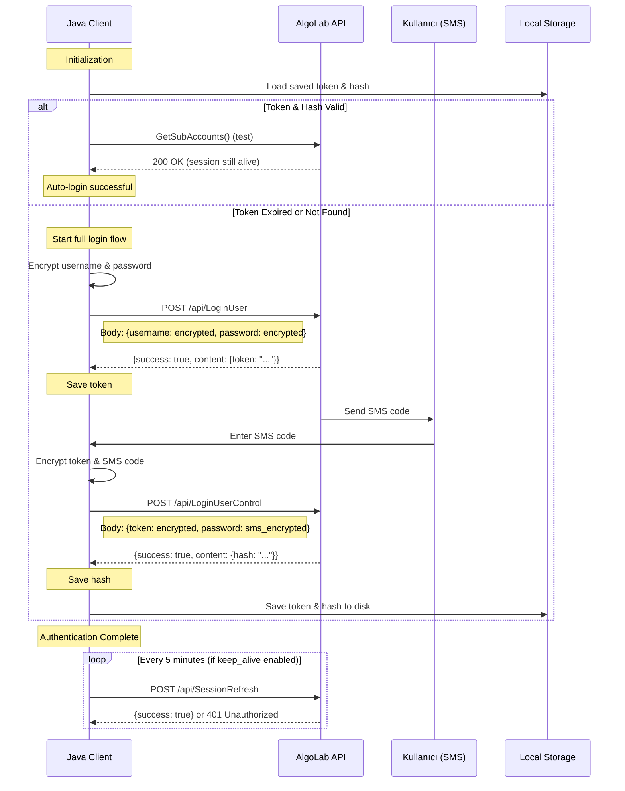

# AlgoLab API - Authentication Flow

**Doküman Tarihi:** 2025-10-09
**Python Kaynak:** `algolab.py` (lines 85-145)

---

## 1. Genel Akış Diyagramı



---

## 2. Detaylı Adımlar

### 2.1 Başlangıç (Initialization)

**Python:**
```python
def start(self):
    if self.auto_login:
        s = self.load_settings()  # Token ve hash'i diskten yükle
        if not s or not self.is_alive:
            # Eğer kaydedilmiş oturum yoksa veya geçersizse
            if self.LoginUser():
                self.LoginUserControl()
        else:
            # Kaydedilmiş oturum geçerli
            print("Otomatik login başarili...")
```

**Java İmplementasyonu için gereksinimler:**
- Token ve hash'i persistent storage'da saklamak (file veya database)
- Session validity check (örn. `GetSubAccounts()` çağrısı ile test)
- Auto-login özelliği (constructor parameter)

---

### 2.2 Adım 1: LoginUser (İlk Giriş)

**Endpoint:** `POST /api/LoginUser`

**Request Headers:**
```json
{
  "APIKEY": "API-{base64_encoded_key}"
}
```

**Request Body:**
```json
{
  "username": "<encrypted_tc_kimlik_no>",
  "password": "<encrypted_denizbank_password>"
}
```

**Encryption Detayları:**
- `username` ve `password` AES-CBC ile şifreleniyor
- IV: 16 byte sıfırlar (`\0` * 16)
- Key: API key'in base64 decoded hali
- Padding: PKCS#7 (16 byte block size)

**Response (Success):**
```json
{
  "success": true,
  "message": "Login başarılı",
  "content": {
    "token": "eyJhbGciOiJIUzI1NiIsInR5cCI6IkpXVCJ9..."
  }
}
```

**Response (Failure):**
```json
{
  "success": false,
  "message": "Kullanıcı adı veya şifre hatalı"
}
```

**Python Kod:**
```python
def LoginUser(self):
    u = self.encrypt(self.username)
    p = self.encrypt(self.password)
    payload = {"username": u, "password": p}
    endpoint = URL_LOGIN_USER
    resp = self.post(endpoint=endpoint, payload=payload, login=True)
    login_user = resp.json()
    if login_user["success"]:
        self.token = login_user["content"]["token"]
        return True
```

**Java Mapping:**
```java
public String loginUser() {
    String encryptedUsername = encrypt(username);
    String encryptedPassword = encrypt(password);

    Map<String, String> payload = Map.of(
        "username", encryptedUsername,
        "password", encryptedPassword
    );

    HttpHeaders headers = new HttpHeaders();
    headers.set("APIKEY", apiKey);

    HttpEntity<Map<String, String>> request = new HttpEntity<>(payload, headers);
    ResponseEntity<LoginUserResponse> response = restTemplate.postForEntity(
        apiUrl + "/api/LoginUser", request, LoginUserResponse.class
    );

    if (response.getBody().isSuccess()) {
        this.token = response.getBody().getContent().getToken();
        return token;
    }
    throw new AlgoLabAuthenticationException("Login failed");
}
```

---

### 2.3 Adım 2: LoginUserControl (SMS Doğrulama)

**Endpoint:** `POST /api/LoginUserControl`

**Request Headers:**
```json
{
  "APIKEY": "API-{base64_encoded_key}"
}
```

**Request Body:**
```json
{
  "token": "<encrypted_token_from_step1>",
  "password": "<encrypted_sms_code>"
}
```

**Response (Success):**
```json
{
  "success": true,
  "message": "Login kontrolü başarılı",
  "content": {
    "hash": "a1b2c3d4e5f6g7h8i9j0k1l2m3n4o5p6..."
  }
}
```

**Python Kod:**
```python
def LoginUserControl(self):
    self.sms_code = input("Cep telefonunuza gelen SMS kodunu girin: ")
    t = self.encrypt(self.token)
    s = self.encrypt(self.sms_code)
    payload = {'token': t, 'password': s}
    endpoint = URL_LOGIN_CONTROL
    resp = self.post(endpoint, payload=payload, login=True)
    login_control = resp.json()
    if login_control["success"]:
        self.hash = login_control["content"]["hash"]
        self.save_settings()  # Token ve hash'i diske kaydet
        return True
```

**Java Mapping:**
```java
public String loginUserControl(String smsCode) {
    String encryptedToken = encrypt(this.token);
    String encryptedSmsCode = encrypt(smsCode);

    Map<String, String> payload = Map.of(
        "token", encryptedToken,
        "password", encryptedSmsCode
    );

    HttpHeaders headers = new HttpHeaders();
    headers.set("APIKEY", apiKey);

    HttpEntity<Map<String, String>> request = new HttpEntity<>(payload, headers);
    ResponseEntity<LoginControlResponse> response = restTemplate.postForEntity(
        apiUrl + "/api/LoginUserControl", request, LoginControlResponse.class
    );

    if (response.getBody().isSuccess()) {
        this.hash = response.getBody().getContent().getHash();
        saveSettings();  // Token ve hash'i persist et
        return hash;
    }
    throw new AlgoLabAuthenticationException("SMS verification failed");
}
```

---

### 2.4 Adım 3: Session Yönetimi

**Token & Hash Saklanması:**
```python
def save_settings(self):
    data = {
        "date": datetime.now().strftime("%Y-%m-%d %H:%M:%S"),
        "token": self.token,
        "hash": self.hash
    }
    with open("./data.json", "w") as f:
        json.dump(data, f)
```

**Java Mapping (File-based):**
```java
@Data
@JsonIgnoreProperties(ignoreUnknown = true)
public class AlgoLabSession {
    private String date;
    private String token;
    private String hash;
}

public void saveSettings() {
    AlgoLabSession session = new AlgoLabSession();
    session.setDate(LocalDateTime.now().toString());
    session.setToken(this.token);
    session.setHash(this.hash);

    try {
        ObjectMapper mapper = new ObjectMapper();
        mapper.writeValue(new File("./algolab-session.json"), session);
    } catch (IOException e) {
        log.error("Failed to save AlgoLab session", e);
    }
}

public boolean loadSettings() {
    try {
        ObjectMapper mapper = new ObjectMapper();
        AlgoLabSession session = mapper.readValue(
            new File("./algolab-session.json"), AlgoLabSession.class
        );
        this.token = session.getToken();
        this.hash = session.getHash();
        return true;
    } catch (IOException e) {
        return false;
    }
}
```

**Alternatif (Database-based):**
```java
// application.properties
// algolab.session.storage=database

@Entity
@Table(name = "algolab_sessions")
public class AlgoLabSessionEntity {
    @Id
    private String userId;
    private String token;
    private String hash;
    private LocalDateTime lastUpdate;
}

@Repository
public interface AlgoLabSessionRepository extends JpaRepository<AlgoLabSessionEntity, String> {
    Optional<AlgoLabSessionEntity> findByUserId(String userId);
}
```

---

### 2.5 Adım 4: Session Refresh (Keep-Alive)

**Endpoint:** `POST /api/SessionRefresh`

**Request Headers:**
```json
{
  "APIKEY": "API-{base64_encoded_key}",
  "Checker": "<sha256_hash>",
  "Authorization": "<hash_from_loginControl>"
}
```

**Request Body:**
```json
{}
```

**Python Kod:**
```python
def SessionRefresh(self, silent=False):
    endpoint = URL_SESSIONREFRESH
    payload = {}
    resp = self.post(endpoint, payload=payload)
    return self.error_check(resp, f, silent)

def ping(self):
    while self.keep_alive:
        p = self.SessionRefresh(silent=True)
        time.sleep(60 * 5)  # Her 5 dakikada bir
```

**Java Mapping:**
```java
@Scheduled(fixedDelay = 300000) // 5 dakika (300000 ms)
public void sessionRefresh() {
    if (!keepAlive) return;

    try {
        Map<String, Object> emptyPayload = Map.of();
        HttpHeaders headers = createAuthenticatedHeaders("/api/SessionRefresh", emptyPayload);

        HttpEntity<Map<String, Object>> request = new HttpEntity<>(emptyPayload, headers);
        ResponseEntity<Map> response = restTemplate.postForEntity(
            apiUrl + "/api/SessionRefresh", request, Map.class
        );

        if (response.getStatusCode() == HttpStatus.OK) {
            log.debug("Session refreshed successfully");
        } else if (response.getStatusCode() == HttpStatus.UNAUTHORIZED) {
            log.warn("Session expired, re-login required");
            this.token = null;
            this.hash = null;
        }
    } catch (Exception e) {
        log.error("Session refresh failed", e);
    }
}
```

---

## 3. Session Validity Check

**Python:**
```python
def GetIsAlive(self):
    try:
        resp = self.GetSubAccounts(silent=True)
        return resp["success"]
    except:
        return False

is_alive = property(GetIsAlive)
```

**Java Mapping:**
```java
public boolean isAlive() {
    try {
        Map<String, Object> response = getSubAccounts();
        return response != null && (boolean) response.get("success");
    } catch (Exception e) {
        return false;
    }
}
```

---

## 4. Error Handling

### 4.1 HTTP Status Kodları

| Status Code | Anlam | Aksiyon |
|-------------|-------|---------|
| 200 | Success | İşlem başarılı |
| 401 | Unauthorized | Token/hash geçersiz → Yeniden login gerekli |
| 404 | Not Found | Endpoint bulunamadı (bazı endpoint'ler henüz aktif değil) |
| 500 | Internal Server Error | AlgoLab tarafında hata |

### 4.2 Python Error Handler

```python
def error_check(self, resp, f, silent=False):
    try:
        if resp.status_code == 200:
            data = resp.json()
            return data
        else:
            if not silent:
                print(f"Error kodu: {resp.status_code}")
                print(resp.text)
            return False
    except:
        if not silent:
            print(f"{f}() fonksiyonunda veri tipi hatasi")
            print(resp.text)
        return False
```

### 4.3 Java Error Handler

```java
public <T> T errorCheck(ResponseEntity<String> response, Class<T> responseClass) {
    if (response.getStatusCode() == HttpStatus.OK) {
        try {
            ObjectMapper mapper = new ObjectMapper();
            return mapper.readValue(response.getBody(), responseClass);
        } catch (JsonProcessingException e) {
            log.error("Failed to parse response", e);
            throw new AlgoLabResponseParseException("Invalid JSON response", e);
        }
    } else if (response.getStatusCode() == HttpStatus.UNAUTHORIZED) {
        log.warn("Unauthorized - session expired");
        this.token = null;
        this.hash = null;
        throw new AlgoLabAuthenticationException("Session expired, re-login required");
    } else {
        log.error("API error: {} - {}", response.getStatusCode(), response.getBody());
        throw new AlgoLabApiException("API request failed: " + response.getStatusCode());
    }
}
```

---

## 5. Java Implementation Checklist

### 5.1 Gerekli Bileşenler

- [ ] **AlgoLabAuthService** - Authentication yönetimi
- [ ] **AlgoLabSessionManager** - Token/hash persistence
- [ ] **AlgoLabEncryptionUtil** - AES encryption (see ALGOLAB_ENCRYPTION_SPEC.md)
- [ ] **AlgoLabCheckerUtil** - SHA-256 checker hash oluşturma
- [ ] **AlgoLabRestClient** - HTTP client wrapper
- [ ] **AlgoLabScheduledTasks** - Session refresh scheduler
- [ ] **AlgoLabExceptionHandler** - Custom exception handling

### 5.2 Configuration Properties

```yaml
algolab:
  api:
    base-url: https://www.algolab.com.tr/api
    hostname: https://www.algolab.com.tr
    key: API-{your_key}
  auth:
    auto-login: true
    keep-alive: true
    refresh-interval: 300000  # 5 minutes in ms
  session:
    storage: file  # file or database
    file-path: ./algolab-session.json
```

### 5.3 DTO Classes

```java
@Data
public class LoginUserRequest {
    private String username;  // encrypted
    private String password;  // encrypted
}

@Data
public class LoginUserResponse {
    private boolean success;
    private String message;
    private LoginUserContent content;

    @Data
    public static class LoginUserContent {
        private String token;
    }
}

@Data
public class LoginControlRequest {
    private String token;     // encrypted
    private String password;  // encrypted (SMS code)
}

@Data
public class LoginControlResponse {
    private boolean success;
    private String message;
    private LoginControlContent content;

    @Data
    public static class LoginControlContent {
        private String hash;
    }
}
```

---

## 6. Security Best Practices

### 6.1 Credential Storage
- **ASLA** plaintext password'ü kodda saklamayın
- Environment variable veya secrets manager kullanın
- Spring Boot için `@ConfigurationProperties` ve externalized config

### 6.2 Token/Hash Storage
- File-based: Encrypted file storage (örn. AES ile şifrelenmiş JSON)
- Database-based: Encrypted column (Spring Security Crypto)
- Cache: Redis ile TTL'li cache

### 6.3 Thread Safety
- Python kodda global `LOCK` kullanılıyor (rate limiting için)
- Java'da `synchronized` veya `ReentrantLock` kullanılabilir
- Alternatif: Guava RateLimiter veya Resilience4j

---

## 7. Sequence Diagram (Full Flow)

```
[Client] --> [AlgoLab]: POST /api/LoginUser (encrypted credentials)
[AlgoLab] --> [Client]: token
[AlgoLab] --> [User SMS]: Send SMS code
[User SMS] --> [Client]: Enter SMS code
[Client] --> [AlgoLab]: POST /api/LoginUserControl (encrypted token + sms)
[AlgoLab] --> [Client]: hash
[Client] --> [Storage]: Save token + hash

--- Authenticated Session ---

[Client] --> [AlgoLab]: POST /api/* (with APIKEY, Checker, Authorization headers)
[AlgoLab] --> [Client]: Response

--- Every 5 minutes ---

[Client] --> [AlgoLab]: POST /api/SessionRefresh
[AlgoLab] --> [Client]: {success: true} or 401

--- On Session Expiry ---

[Client] --> [Client]: Clear token & hash
[Client] --> [Client]: Restart LoginUser flow
```

---

**Doküman Sonu**