# Data Flow Documentation - BIST Trading Platform

## Overview

This document describes the data flow patterns and sequences for the BIST Trading Platform, covering user authentication, order execution, market data streaming, and event processing. Each flow is illustrated with Mermaid sequence diagrams to provide clear visual representation of the system interactions.

## 1. User Authentication Flow

The authentication system uses JWT tokens with refresh token mechanism to provide secure and scalable user authentication.

### 1.1 User Registration Process

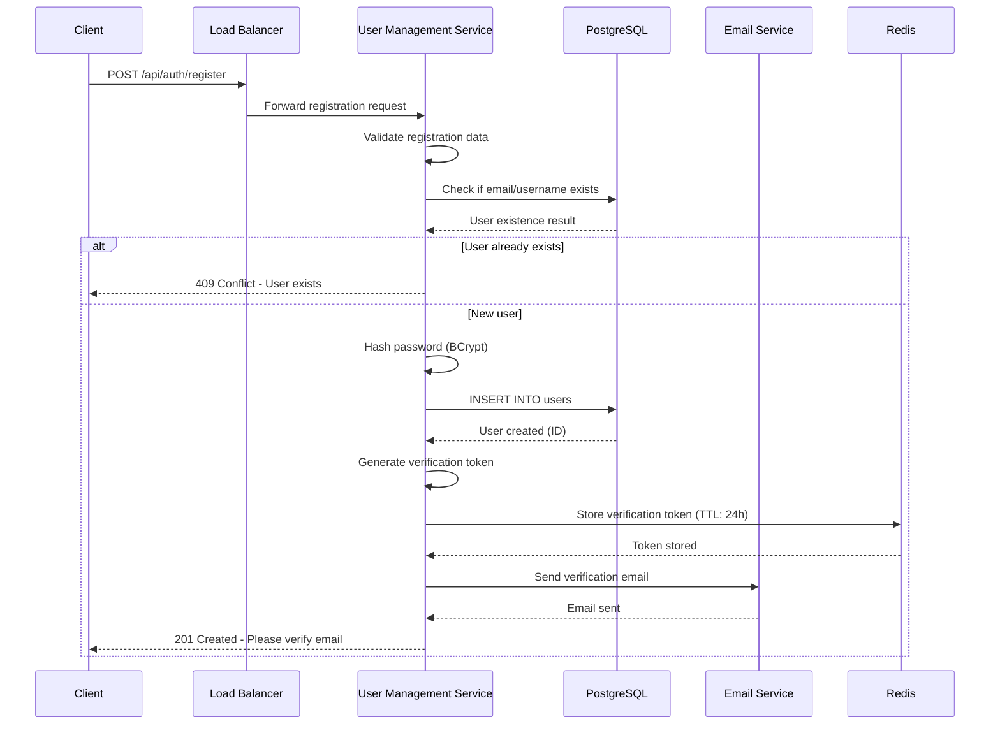
```mermaid
sequenceDiagram
    participant Client
    participant LoadBalancer as Load Balancer
    participant UserMgmt as User Management Service
    participant DB as PostgreSQL
    participant Email as Email Service
    participant Redis

    Client->>LoadBalancer: POST /api/auth/register
    LoadBalancer->>UserMgmt: Forward registration request

    UserMgmt->>UserMgmt: Validate registration data
    UserMgmt->>DB: Check if email/username exists
    DB-->>UserMgmt: User existence result

    alt User already exists
        UserMgmt-->>Client: 409 Conflict - User exists
    else New user
        UserMgmt->>UserMgmt: Hash password (BCrypt)
        UserMgmt->>DB: INSERT INTO users
        DB-->>UserMgmt: User created (ID)

        UserMgmt->>UserMgmt: Generate verification token
        UserMgmt->>Redis: Store verification token (TTL: 24h)
        Redis-->>UserMgmt: Token stored

        UserMgmt->>Email: Send verification email
        Email-->>UserMgmt: Email sent

        UserMgmt-->>Client: 201 Created - Please verify email
    end
```

### 1.2 Login Flow with JWT

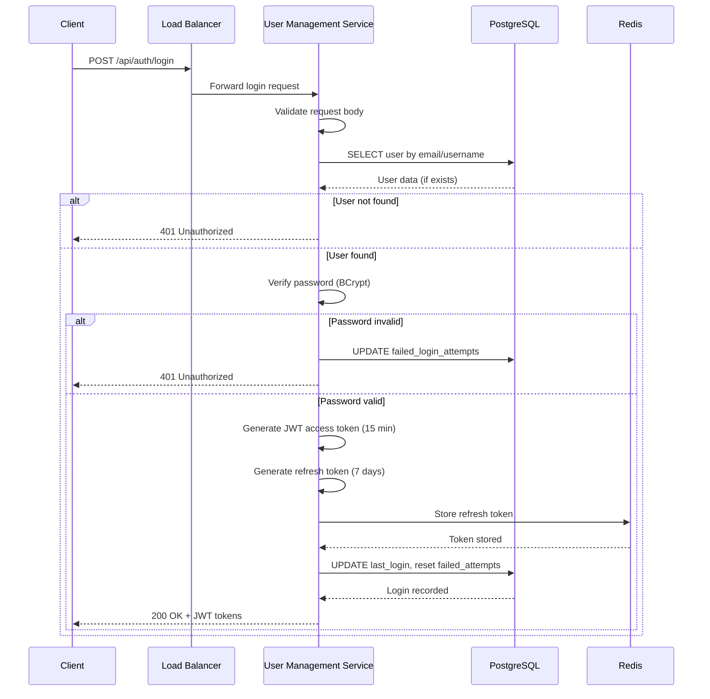
```mermaid
sequenceDiagram
    participant Client
    participant LoadBalancer as Load Balancer
    participant UserMgmt as User Management Service
    participant DB as PostgreSQL
    participant Redis

    Client->>LoadBalancer: POST /api/auth/login
    LoadBalancer->>UserMgmt: Forward login request

    UserMgmt->>UserMgmt: Validate request body
    UserMgmt->>DB: SELECT user by email/username
    DB-->>UserMgmt: User data (if exists)

    alt User not found
        UserMgmt-->>Client: 401 Unauthorized
    else User found
        UserMgmt->>UserMgmt: Verify password (BCrypt)

        alt Password invalid
            UserMgmt->>DB: UPDATE failed_login_attempts
            UserMgmt-->>Client: 401 Unauthorized
        else Password valid
            UserMgmt->>UserMgmt: Generate JWT access token (15 min)
            UserMgmt->>UserMgmt: Generate refresh token (7 days)

            UserMgmt->>Redis: Store refresh token
            Redis-->>UserMgmt: Token stored

            UserMgmt->>DB: UPDATE last_login, reset failed_attempts
            DB-->>UserMgmt: Login recorded

            UserMgmt-->>Client: 200 OK + JWT tokens
        end
    end
```

### 1.3 Token Refresh Mechanism

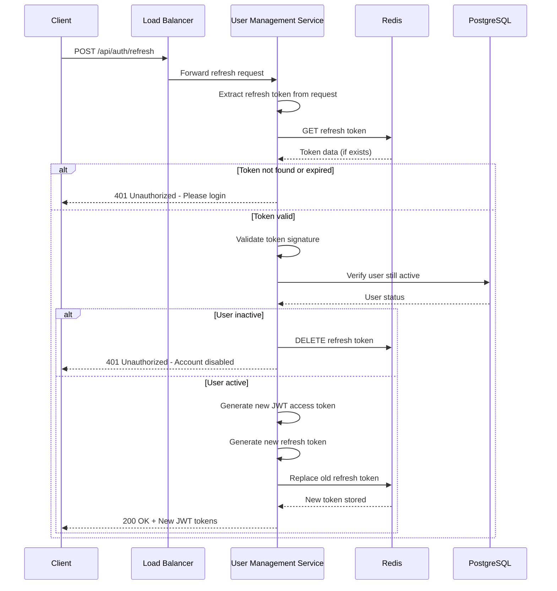
```mermaid
sequenceDiagram
    participant Client
    participant LoadBalancer as Load Balancer
    participant UserMgmt as User Management Service
    participant Redis
    participant DB as PostgreSQL

    Client->>LoadBalancer: POST /api/auth/refresh
    LoadBalancer->>UserMgmt: Forward refresh request

    UserMgmt->>UserMgmt: Extract refresh token from request
    UserMgmt->>Redis: GET refresh token
    Redis-->>UserMgmt: Token data (if exists)

    alt Token not found or expired
        UserMgmt-->>Client: 401 Unauthorized - Please login
    else Token valid
        UserMgmt->>UserMgmt: Validate token signature
        UserMgmt->>DB: Verify user still active
        DB-->>UserMgmt: User status

        alt User inactive
            UserMgmt->>Redis: DELETE refresh token
            UserMgmt-->>Client: 401 Unauthorized - Account disabled
        else User active
            UserMgmt->>UserMgmt: Generate new JWT access token
            UserMgmt->>UserMgmt: Generate new refresh token

            UserMgmt->>Redis: Replace old refresh token
            Redis-->>UserMgmt: New token stored

            UserMgmt-->>Client: 200 OK + New JWT tokens
        end
    end
```

## 2. Order Execution Flow

The order execution flow handles the complete lifecycle from order placement through broker routing to execution and settlement.

### 2.1 Order Placement

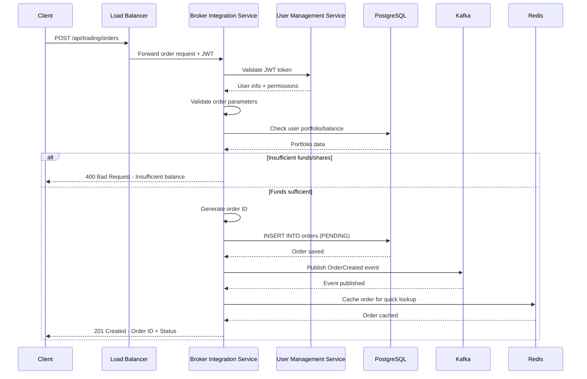
```mermaid
sequenceDiagram
    participant Client
    participant LoadBalancer as Load Balancer
    participant BrokerSvc as Broker Integration Service
    participant UserMgmt as User Management Service
    participant DB as PostgreSQL
    participant Kafka
    participant Redis

    Client->>LoadBalancer: POST /api/trading/orders
    LoadBalancer->>BrokerSvc: Forward order request + JWT

    BrokerSvc->>UserMgmt: Validate JWT token
    UserMgmt-->>BrokerSvc: User info + permissions

    BrokerSvc->>BrokerSvc: Validate order parameters
    BrokerSvc->>DB: Check user portfolio/balance
    DB-->>BrokerSvc: Portfolio data

    alt Insufficient funds/shares
        BrokerSvc-->>Client: 400 Bad Request - Insufficient balance
    else Funds sufficient
        BrokerSvc->>BrokerSvc: Generate order ID
        BrokerSvc->>DB: INSERT INTO orders (PENDING)
        DB-->>BrokerSvc: Order saved

        BrokerSvc->>Kafka: Publish OrderCreated event
        Kafka-->>BrokerSvc: Event published

        BrokerSvc->>Redis: Cache order for quick lookup
        Redis-->>BrokerSvc: Order cached

        BrokerSvc-->>Client: 201 Created - Order ID + Status
    end
```

### 2.2 Order Routing to Broker

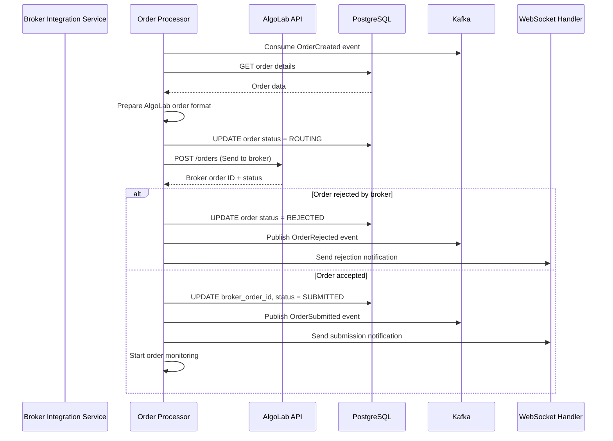
```mermaid
sequenceDiagram
    participant BrokerSvc as Broker Integration Service
    participant OrderProcessor as Order Processor
    participant AlgoLab as AlgoLab API
    participant DB as PostgreSQL
    participant Kafka
    participant WebSocket as WebSocket Handler

    OrderProcessor->>Kafka: Consume OrderCreated event
    OrderProcessor->>DB: GET order details
    DB-->>OrderProcessor: Order data

    OrderProcessor->>OrderProcessor: Prepare AlgoLab order format
    OrderProcessor->>DB: UPDATE order status = ROUTING

    OrderProcessor->>AlgoLab: POST /orders (Send to broker)
    AlgoLab-->>OrderProcessor: Broker order ID + status

    alt Order rejected by broker
        OrderProcessor->>DB: UPDATE order status = REJECTED
        OrderProcessor->>Kafka: Publish OrderRejected event
        OrderProcessor->>WebSocket: Send rejection notification
    else Order accepted
        OrderProcessor->>DB: UPDATE broker_order_id, status = SUBMITTED
        OrderProcessor->>Kafka: Publish OrderSubmitted event
        OrderProcessor->>WebSocket: Send submission notification

        OrderProcessor->>OrderProcessor: Start order monitoring
    end
```

### 2.3 Order Execution and Settlement

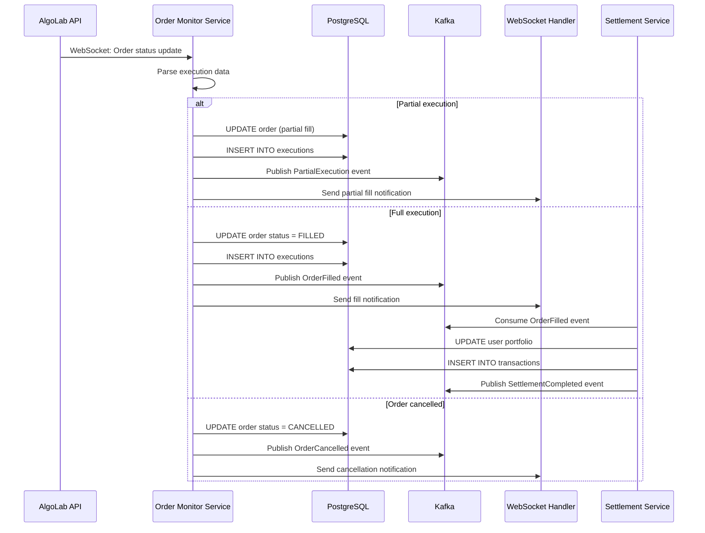
```mermaid
sequenceDiagram
    participant AlgoLab as AlgoLab API
    participant OrderMonitor as Order Monitor Service
    participant DB as PostgreSQL
    participant Kafka
    participant WebSocket as WebSocket Handler
    participant Settlement as Settlement Service

    AlgoLab->>OrderMonitor: WebSocket: Order status update
    OrderMonitor->>OrderMonitor: Parse execution data

    alt Partial execution
        OrderMonitor->>DB: UPDATE order (partial fill)
        OrderMonitor->>DB: INSERT INTO executions
        OrderMonitor->>Kafka: Publish PartialExecution event
        OrderMonitor->>WebSocket: Send partial fill notification

    else Full execution
        OrderMonitor->>DB: UPDATE order status = FILLED
        OrderMonitor->>DB: INSERT INTO executions
        OrderMonitor->>Kafka: Publish OrderFilled event
        OrderMonitor->>WebSocket: Send fill notification

        Settlement->>Kafka: Consume OrderFilled event
        Settlement->>DB: UPDATE user portfolio
        Settlement->>DB: INSERT INTO transactions
        Settlement->>Kafka: Publish SettlementCompleted event

    else Order cancelled
        OrderMonitor->>DB: UPDATE order status = CANCELLED
        OrderMonitor->>Kafka: Publish OrderCancelled event
        OrderMonitor->>WebSocket: Send cancellation notification
    end
```

## 3. Market Data Flow

The market data flow handles real-time data streaming from AlgoLab through WebSocket connections and stores it in TimescaleDB for analysis.

### 3.1 WebSocket Connection and Authentication

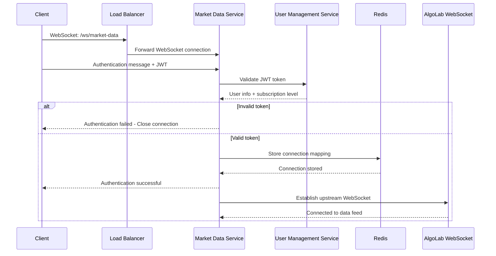
```mermaid
sequenceDiagram
    participant Client
    participant LoadBalancer as Load Balancer
    participant MarketData as Market Data Service
    participant UserMgmt as User Management Service
    participant Redis
    participant AlgoLab as AlgoLab WebSocket

    Client->>LoadBalancer: WebSocket: /ws/market-data
    LoadBalancer->>MarketData: Forward WebSocket connection

    Client->>MarketData: Authentication message + JWT
    MarketData->>UserMgmt: Validate JWT token
    UserMgmt-->>MarketData: User info + subscription level

    alt Invalid token
        MarketData-->>Client: Authentication failed - Close connection
    else Valid token
        MarketData->>Redis: Store connection mapping
        Redis-->>MarketData: Connection stored

        MarketData-->>Client: Authentication successful

        MarketData->>AlgoLab: Establish upstream WebSocket
        AlgoLab-->>MarketData: Connected to data feed
    end
```

### 3.2 Real-time Data Streaming

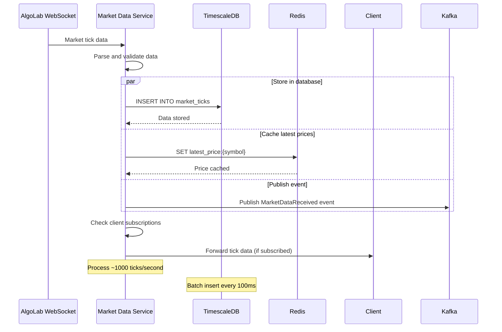
```mermaid
sequenceDiagram
    participant AlgoLab as AlgoLab WebSocket
    participant MarketData as Market Data Service
    participant TimescaleDB as TimescaleDB
    participant Redis
    participant Client
    participant Kafka

    AlgoLab->>MarketData: Market tick data
    MarketData->>MarketData: Parse and validate data

    par Store in database
        MarketData->>TimescaleDB: INSERT INTO market_ticks
        TimescaleDB-->>MarketData: Data stored
    and Cache latest prices
        MarketData->>Redis: SET latest_price:{symbol}
        Redis-->>MarketData: Price cached
    and Publish event
        MarketData->>Kafka: Publish MarketDataReceived event
    end

    MarketData->>MarketData: Check client subscriptions
    MarketData->>Client: Forward tick data (if subscribed)

    Note over MarketData: Process ~1000 ticks/second
    Note over TimescaleDB: Batch insert every 100ms
```

### 3.3 TimescaleDB Storage and Aggregation

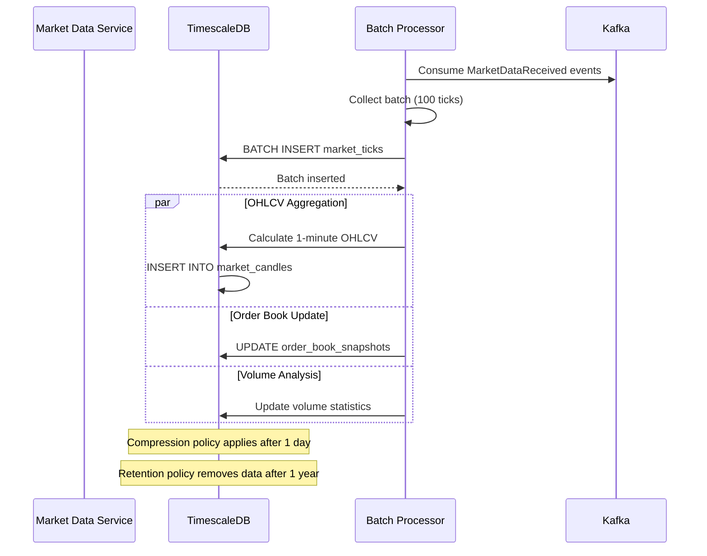
```mermaid
sequenceDiagram
    participant MarketData as Market Data Service
    participant TimescaleDB as TimescaleDB
    participant BatchProcessor as Batch Processor
    participant Kafka

    BatchProcessor->>Kafka: Consume MarketDataReceived events
    BatchProcessor->>BatchProcessor: Collect batch (100 ticks)

    BatchProcessor->>TimescaleDB: BATCH INSERT market_ticks
    TimescaleDB-->>BatchProcessor: Batch inserted

    par OHLCV Aggregation
        BatchProcessor->>TimescaleDB: Calculate 1-minute OHLCV
        TimescaleDB->>TimescaleDB: INSERT INTO market_candles
    and Order Book Update
        BatchProcessor->>TimescaleDB: UPDATE order_book_snapshots
    and Volume Analysis
        BatchProcessor->>TimescaleDB: Update volume statistics
    end

    Note over TimescaleDB: Compression policy applies after 1 day
    Note over TimescaleDB: Retention policy removes data after 1 year
```

## 4. Event Flow

The event-driven architecture uses Kafka for asynchronous communication and event sourcing patterns across services.

### 4.1 Kafka Topics and Event Producers

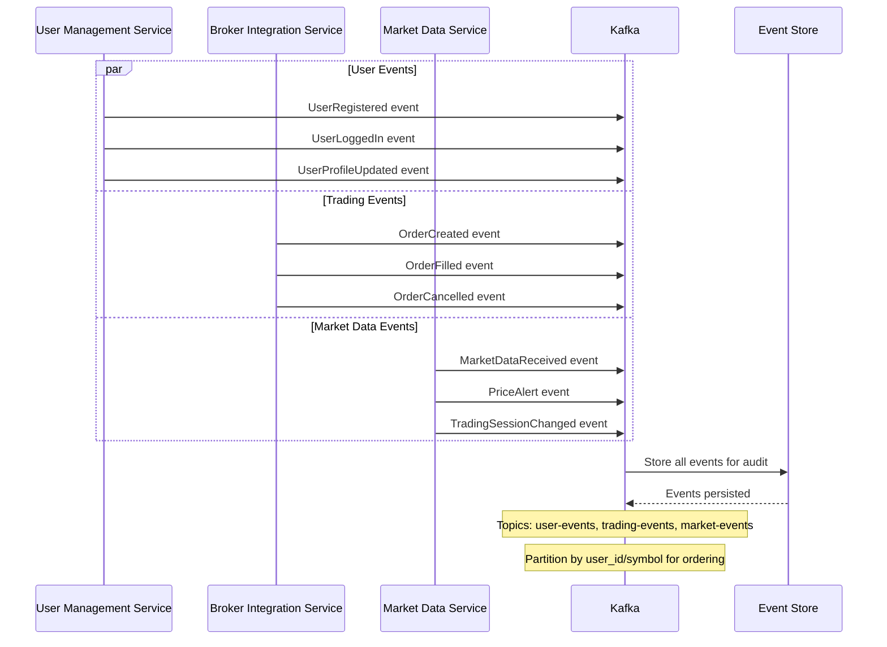
```mermaid
sequenceDiagram
    participant UserMgmt as User Management Service
    participant BrokerSvc as Broker Integration Service
    participant MarketData as Market Data Service
    participant Kafka
    participant EventStore as Event Store

    par User Events
        UserMgmt->>Kafka: UserRegistered event
        UserMgmt->>Kafka: UserLoggedIn event
        UserMgmt->>Kafka: UserProfileUpdated event
    and Trading Events
        BrokerSvc->>Kafka: OrderCreated event
        BrokerSvc->>Kafka: OrderFilled event
        BrokerSvc->>Kafka: OrderCancelled event
    and Market Data Events
        MarketData->>Kafka: MarketDataReceived event
        MarketData->>Kafka: PriceAlert event
        MarketData->>Kafka: TradingSessionChanged event
    end

    Kafka->>EventStore: Store all events for audit
    EventStore-->>Kafka: Events persisted

    Note over Kafka: Topics: user-events, trading-events, market-events
    Note over Kafka: Partition by user_id/symbol for ordering
```

### 4.2 Event Consumers and Processing

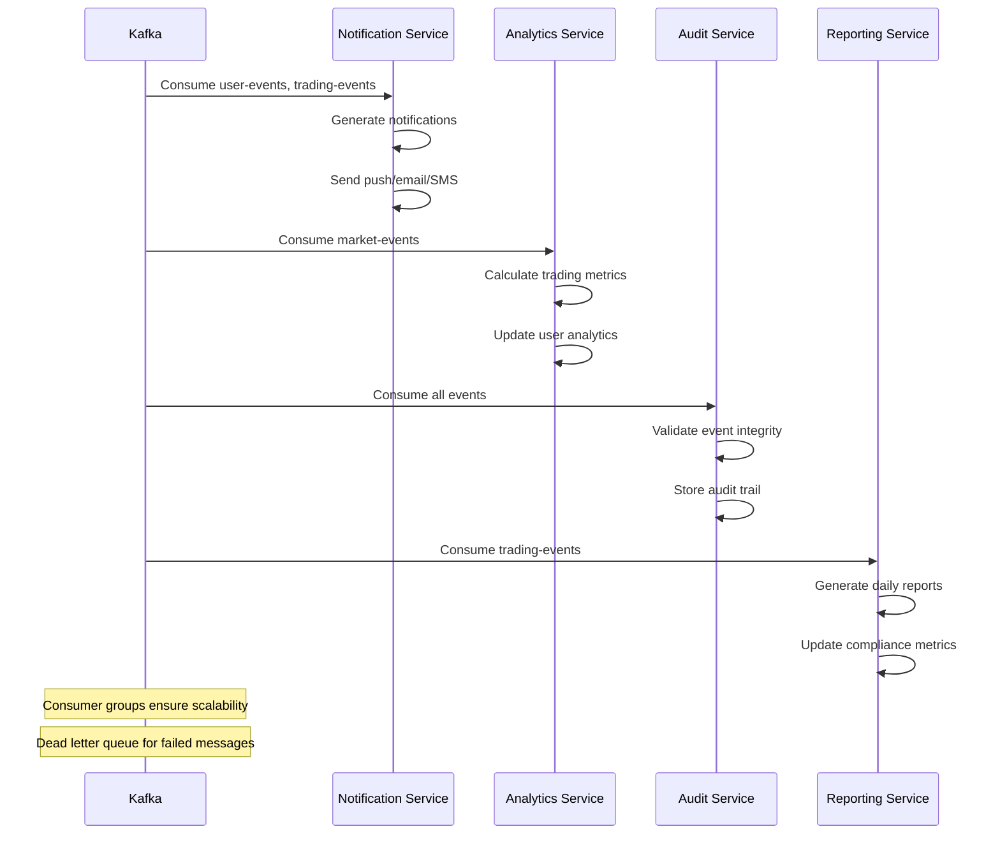
```mermaid
sequenceDiagram
    participant Kafka
    participant NotificationSvc as Notification Service
    participant AnalyticsSvc as Analytics Service
    participant AuditSvc as Audit Service
    participant ReportingSvc as Reporting Service

    Kafka->>NotificationSvc: Consume user-events, trading-events
    NotificationSvc->>NotificationSvc: Generate notifications
    NotificationSvc->>NotificationSvc: Send push/email/SMS

    Kafka->>AnalyticsSvc: Consume market-events
    AnalyticsSvc->>AnalyticsSvc: Calculate trading metrics
    AnalyticsSvc->>AnalyticsSvc: Update user analytics

    Kafka->>AuditSvc: Consume all events
    AuditSvc->>AuditSvc: Validate event integrity
    AuditSvc->>AuditSvc: Store audit trail

    Kafka->>ReportingSvc: Consume trading-events
    ReportingSvc->>ReportingSvc: Generate daily reports
    ReportingSvc->>ReportingSvc: Update compliance metrics

    Note over Kafka: Consumer groups ensure scalability
    Note over Kafka: Dead letter queue for failed messages
```

### 4.3 Event Sourcing Pattern

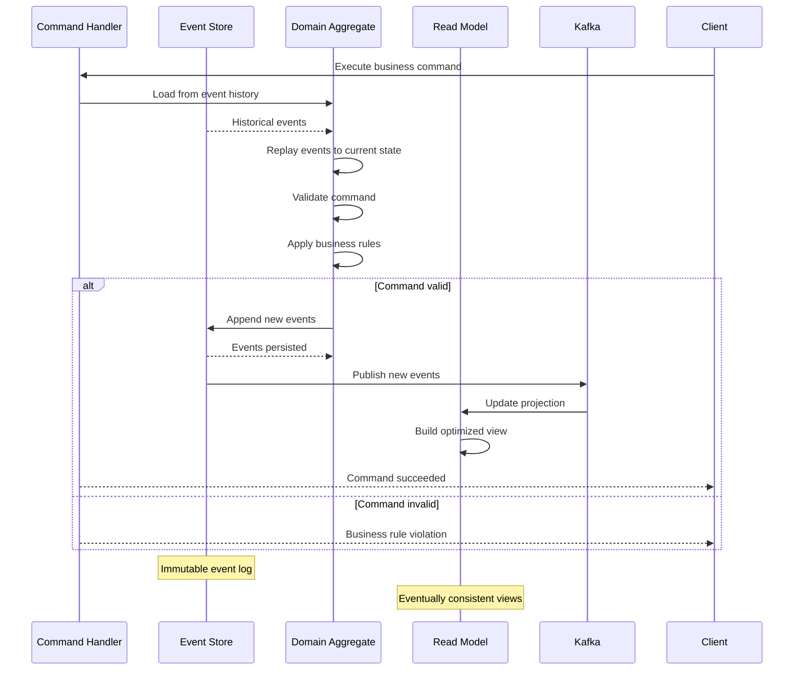
```mermaid
sequenceDiagram
    participant Command as Command Handler
    participant EventStore as Event Store
    participant Aggregate as Domain Aggregate
    participant ReadModel as Read Model
    participant Kafka
    participant Client

    Client->>Command: Execute business command
    Command->>Aggregate: Load from event history
    EventStore-->>Aggregate: Historical events

    Aggregate->>Aggregate: Replay events to current state
    Aggregate->>Aggregate: Validate command
    Aggregate->>Aggregate: Apply business rules

    alt Command valid
        Aggregate->>EventStore: Append new events
        EventStore-->>Aggregate: Events persisted

        EventStore->>Kafka: Publish new events
        Kafka->>ReadModel: Update projection
        ReadModel->>ReadModel: Build optimized view

        Command-->>Client: Command succeeded
    else Command invalid
        Command-->>Client: Business rule violation
    end

    Note over EventStore: Immutable event log
    Note over ReadModel: Eventually consistent views
```

## 5. Cross-Service Communication Patterns

### 5.1 Synchronous Communication (REST)

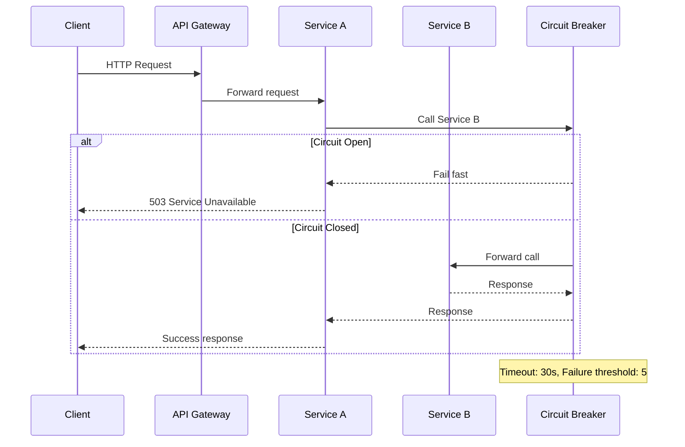
```mermaid
sequenceDiagram
    participant Client
    participant APIGateway as API Gateway
    participant ServiceA as Service A
    participant ServiceB as Service B
    participant CircuitBreaker as Circuit Breaker

    Client->>APIGateway: HTTP Request
    APIGateway->>ServiceA: Forward request

    ServiceA->>CircuitBreaker: Call Service B

    alt Circuit Open
        CircuitBreaker-->>ServiceA: Fail fast
        ServiceA-->>Client: 503 Service Unavailable
    else Circuit Closed
        CircuitBreaker->>ServiceB: Forward call
        ServiceB-->>CircuitBreaker: Response
        CircuitBreaker-->>ServiceA: Response
        ServiceA-->>Client: Success response
    end

    Note over CircuitBreaker: Timeout: 30s, Failure threshold: 5
```

### 5.2 Asynchronous Communication (Events)

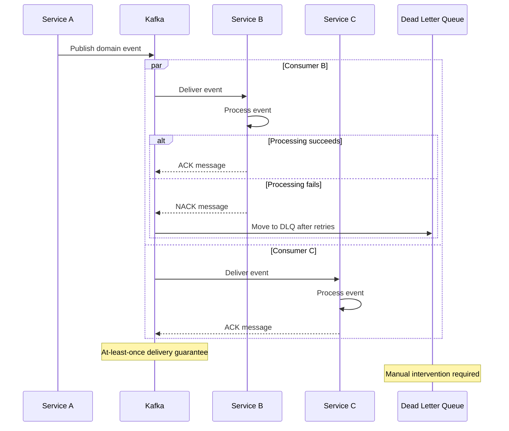
```mermaid
sequenceDiagram
    participant ServiceA as Service A
    participant Kafka
    participant ServiceB as Service B
    participant ServiceC as Service C
    participant DeadLetter as Dead Letter Queue

    ServiceA->>Kafka: Publish domain event

    par Consumer B
        Kafka->>ServiceB: Deliver event
        ServiceB->>ServiceB: Process event

        alt Processing succeeds
            ServiceB-->>Kafka: ACK message
        else Processing fails
            ServiceB-->>Kafka: NACK message
            Kafka->>DeadLetter: Move to DLQ after retries
        end
    and Consumer C
        Kafka->>ServiceC: Deliver event
        ServiceC->>ServiceC: Process event
        ServiceC-->>Kafka: ACK message
    end

    Note over Kafka: At-least-once delivery guarantee
    Note over DeadLetter: Manual intervention required
```

## 6. Error Handling and Resilience Patterns

### 6.1 Retry Pattern with Exponential Backoff

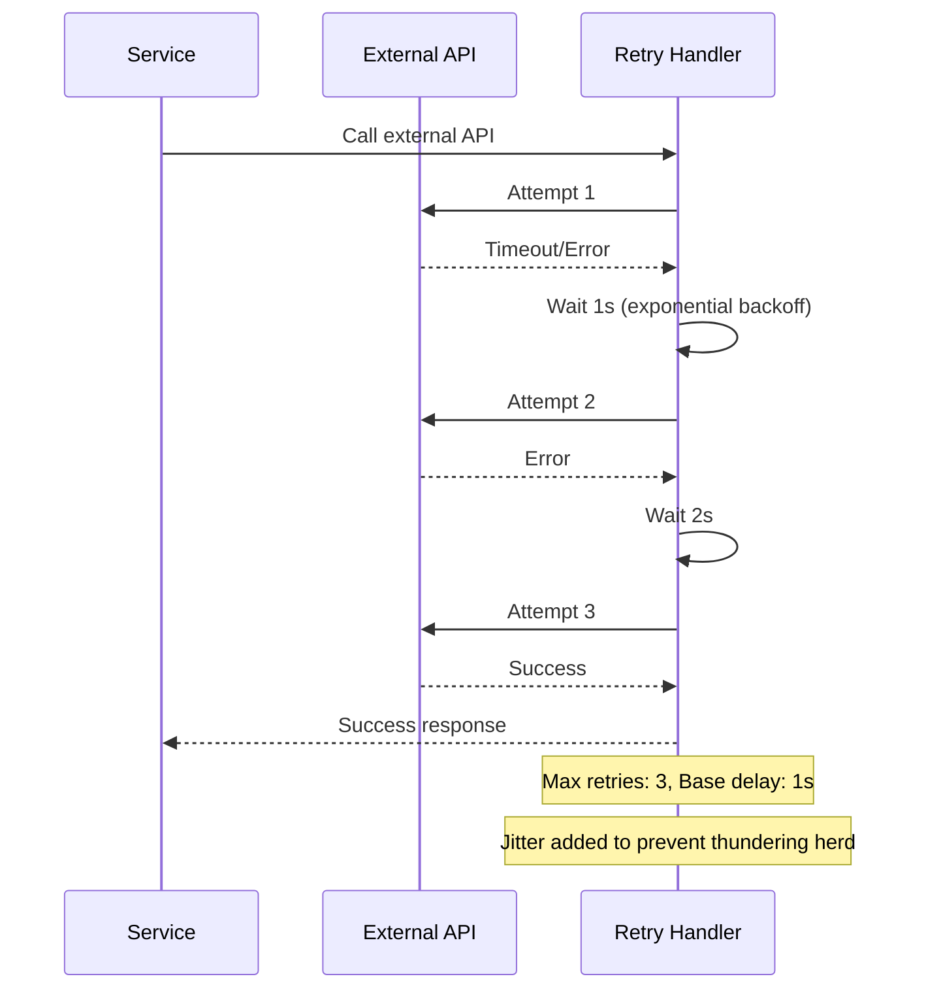
```mermaid
sequenceDiagram
    participant Service as Service
    participant ExternalAPI as External API
    participant RetryHandler as Retry Handler

    Service->>RetryHandler: Call external API
    RetryHandler->>ExternalAPI: Attempt 1
    ExternalAPI-->>RetryHandler: Timeout/Error

    RetryHandler->>RetryHandler: Wait 1s (exponential backoff)
    RetryHandler->>ExternalAPI: Attempt 2
    ExternalAPI-->>RetryHandler: Error

    RetryHandler->>RetryHandler: Wait 2s
    RetryHandler->>ExternalAPI: Attempt 3
    ExternalAPI-->>RetryHandler: Success

    RetryHandler-->>Service: Success response

    Note over RetryHandler: Max retries: 3, Base delay: 1s
    Note over RetryHandler: Jitter added to prevent thundering herd
```

### 6.2 Saga Pattern for Distributed Transactions

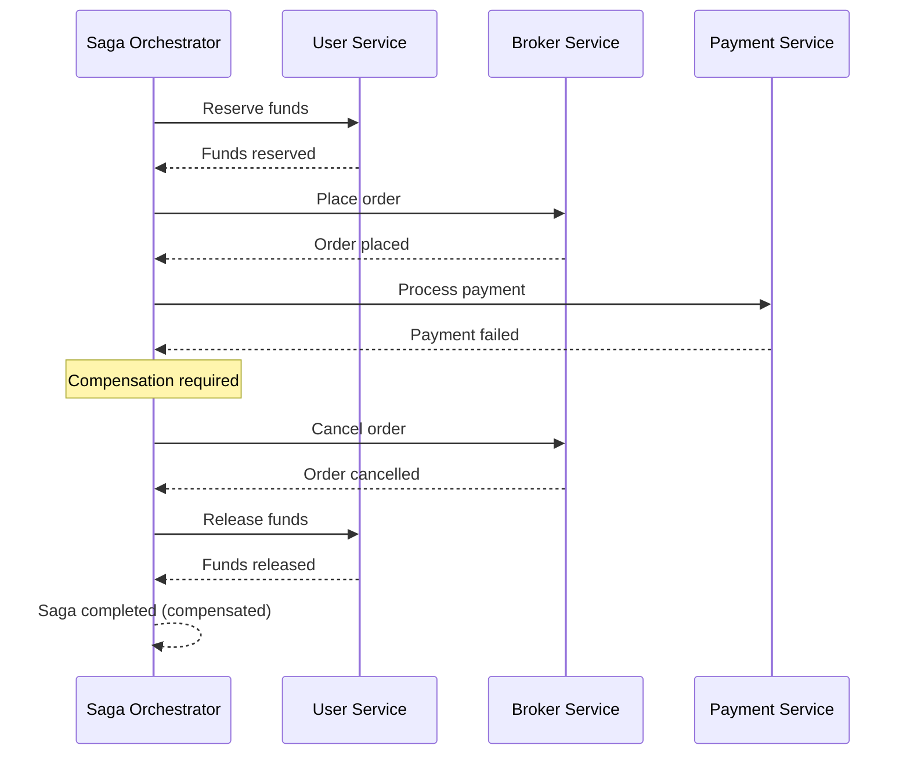
```mermaid
sequenceDiagram
    participant Orchestrator as Saga Orchestrator
    participant UserSvc as User Service
    participant BrokerSvc as Broker Service
    participant PaymentSvc as Payment Service

    Orchestrator->>UserSvc: Reserve funds
    UserSvc-->>Orchestrator: Funds reserved

    Orchestrator->>BrokerSvc: Place order
    BrokerSvc-->>Orchestrator: Order placed

    Orchestrator->>PaymentSvc: Process payment
    PaymentSvc-->>Orchestrator: Payment failed

    Note over Orchestrator: Compensation required

    Orchestrator->>BrokerSvc: Cancel order
    BrokerSvc-->>Orchestrator: Order cancelled

    Orchestrator->>UserSvc: Release funds
    UserSvc-->>Orchestrator: Funds released

    Orchestrator-->>Orchestrator: Saga completed (compensated)
```

## 7. Performance and Monitoring

### 7.1 Distributed Tracing

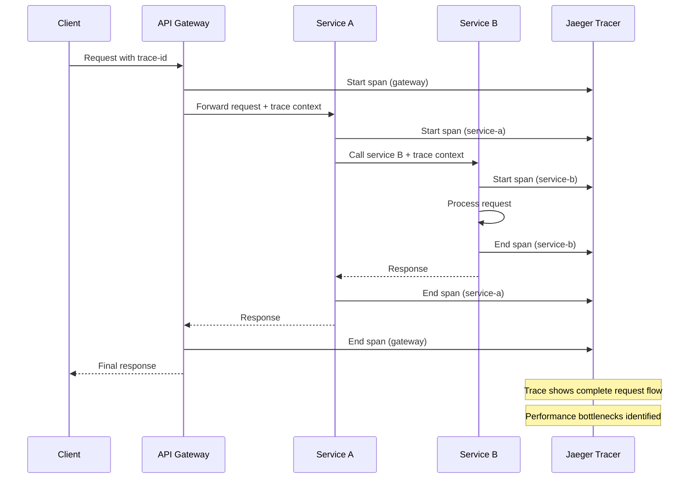
```mermaid
sequenceDiagram
    participant Client
    participant Gateway as API Gateway
    participant ServiceA as Service A
    participant ServiceB as Service B
    participant Jaeger as Jaeger Tracer

    Client->>Gateway: Request with trace-id
    Gateway->>Jaeger: Start span (gateway)
    Gateway->>ServiceA: Forward request + trace context

    ServiceA->>Jaeger: Start span (service-a)
    ServiceA->>ServiceB: Call service B + trace context

    ServiceB->>Jaeger: Start span (service-b)
    ServiceB->>ServiceB: Process request
    ServiceB->>Jaeger: End span (service-b)
    ServiceB-->>ServiceA: Response

    ServiceA->>Jaeger: End span (service-a)
    ServiceA-->>Gateway: Response

    Gateway->>Jaeger: End span (gateway)
    Gateway-->>Client: Final response

    Note over Jaeger: Trace shows complete request flow
    Note over Jaeger: Performance bottlenecks identified
```

---

## Kafka Topics Configuration

| Topic Name | Partitions | Replication | Retention | Purpose |
|------------|------------|-------------|-----------|---------|
| **user-events** | 6 | 3 | 30 days | User lifecycle events |
| **trading-events** | 12 | 3 | 7 years | Trading activities (compliance) |
| **market-events** | 24 | 3 | 1 day | Real-time market data |
| **notification-events** | 3 | 3 | 7 days | User notifications |
| **audit-events** | 6 | 3 | 10 years | Security and audit logs |

## Event Schemas

### UserRegistered Event
```json
{
  "eventId": "uuid",
  "eventType": "UserRegistered",
  "timestamp": "2024-09-24T10:30:00Z",
  "version": "1.0",
  "data": {
    "userId": "uuid",
    "email": "user@example.com",
    "registrationSource": "web",
    "subscriptionLevel": "basic"
  }
}
```

### OrderCreated Event
```json
{
  "eventId": "uuid",
  "eventType": "OrderCreated",
  "timestamp": "2024-09-24T10:30:00Z",
  "version": "1.0",
  "data": {
    "orderId": "uuid",
    "userId": "uuid",
    "symbol": "AKBNK",
    "side": "BUY",
    "quantity": 1000,
    "price": 15.75,
    "orderType": "LIMIT"
  }
}
```

### MarketDataReceived Event
```json
{
  "eventId": "uuid",
  "eventType": "MarketDataReceived",
  "timestamp": "2024-09-24T10:30:00.123Z",
  "version": "1.0",
  "data": {
    "symbol": "AKBNK",
    "price": 15.75,
    "volume": 1000,
    "timestamp": "2024-09-24T10:30:00.123Z",
    "source": "algolab"
  }
}
```

---

**Last Updated:** September 2024
**Version:** 1.0
**Maintainer:** BIST Trading Platform Architecture Team
┌─────────────────┐   ┌─────────────────┐   ┌─────────────────┐
│ Market Data     │──►│ market-data-    │──►│ TimescaleDB     │
│ Providers       │   │ service         │   │ Storage         │
│ (AlgoLab, etc.) │   │ (Port: 8082)    │   │                 │
└─────────────────┘   └─────────┬───────┘   └─────────────────┘
                                │
                                ▼
                    ┌─────────────────┐   ┌─────────────────┐
                    │ WebSocket       │──►│ Client          │
                    │ Streaming       │   │ Applications    │
                    │ (<50ms latency) │   │                 │
                    └─────────────────┘   └─────────────────┘
```

**Processing Steps**:
1. **Ingestion**: Market data received via HTTP/WebSocket from external providers
2. **Validation**: Data validation against BIST symbol formats and market rules
3. **Transformation**: Convert to internal format with Turkish market specifics
4. **Storage**: Persist to TimescaleDB with time-series optimization
5. **Distribution**: Real-time streaming to connected clients via WebSocket

**Performance Metrics**:
- **Throughput**: 50,000+ ticks per second
- **Latency**: <50ms end-to-end
- **Storage**: Compressed time-series with retention policies

### 2. User Authentication Flow

```
Client → Authentication → JWT Generation → Session Storage → Access Control
```

#### Detailed Flow:
```
┌─────────────────┐   ┌─────────────────┐   ┌─────────────────┐
│ Client Login    │──►│ user-management-│──►│ Database        │
│ Request         │   │ service         │   │ Validation      │
│                 │   │ (Port: 8081)    │   │                 │
└─────────────────┘   └─────────┬───────┘   └─────────────────┘
                                │
                                ▼
                    ┌─────────────────┐   ┌─────────────────┐
                    │ JWT Token       │──►│ Redis Session   │
                    │ Generation      │   │ Storage (24h)   │
                    │                 │   │                 │
                    └─────────────────┘   └─────────────────┘
                                │
                                ▼
                    ┌─────────────────┐
                    │ Client Response │
                    │ with JWT Token  │
                    │                 │
                    └─────────────────┘
```

**Authentication Steps**:
1. **Credential Validation**: Username/password verification against PostgreSQL
2. **Turkish Identity Check**: TCKN validation for Turkish users
3. **JWT Generation**: Create signed JWT with user claims and permissions
4. **Session Storage**: Store session data in Redis with 24-hour TTL
5. **Response**: Return JWT token and user profile to client

### 3. Trading Order Flow

```
Order Request → Validation → Broker Integration → Order Tracking → Status Updates
```

#### Detailed Flow:
```
┌─────────────────┐   ┌─────────────────┐   ┌─────────────────┐
│ Client Order    │──►│ broker-         │──►│ AlgoLab API     │
│ Request         │   │ integration-    │   │ Integration     │
│                 │   │ service         │   │                 │
└─────────────────┘   │ (Port: 8083)    │   └─────────────────┘
                      └─────────┬───────┘
                                │
                                ▼
                    ┌─────────────────┐   ┌─────────────────┐
                    │ Order Status    │──►│ Database        │
                    │ Updates         │   │ Persistence     │
                    │                 │   │                 │
                    └─────────────────┘   └─────────────────┘
                                │
                                ▼
                    ┌─────────────────┐
                    │ Real-time       │
                    │ Notifications   │
                    │ (WebSocket)     │
                    └─────────────────┘
```

**Order Processing Steps**:
1. **Order Validation**: Symbol, quantity, price validation
2. **Risk Checks**: Account balance and position limits
3. **Broker Communication**: Send order to AlgoLab API with encryption
4. **Status Tracking**: Monitor order execution status
5. **Real-time Updates**: Push notifications to client via WebSocket

## Data Models and Schemas

### 1. Market Data Schema

```json
{
  "marketTick": {
    "symbol": "AKBNK",
    "price": 15.75,
    "volume": 10000,
    "timestamp": "2024-09-24T10:30:00.000Z",
    "bidPrice": 15.74,
    "askPrice": 15.76,
    "lastUpdate": "2024-09-24T10:30:00.123Z"
  }
}
```

### 2. Order Data Schema

```json
{
  "order": {
    "id": "ORD-123456789",
    "userId": "USER-12345",
    "symbol": "THYAO",
    "orderType": "LIMIT",
    "side": "BUY",
    "quantity": 1000,
    "price": 45.50,
    "status": "SUBMITTED",
    "timestamp": "2024-09-24T10:30:00.000Z",
    "brokerOrderId": "ALG-987654321"
  }
}
```

### 3. User Session Schema

```json
{
  "session": {
    "userId": "USER-12345",
    "token": "eyJ0eXAiOiJKV1QiLCJhbGciOiJIUzI1NiJ9...",
    "authenticated": true,
    "timestamp": 1695546600000,
    "username": "trader@example.com",
    "expiresAt": 1695633000000
  }
}
```

## Message Flow Patterns

### 1. Synchronous Request-Response

**Used for**:
- User authentication
- Order placement
- Profile updates
- Market data queries

**Pattern**:
```
Client ──HTTP Request──► Service ──Response──► Client
```

**Example**: User login request
```http
POST /api/auth/login
Content-Type: application/json

{
  "username": "trader@example.com",
  "password": "encrypted_password"
}
```

### 2. Asynchronous Event Streaming

**Used for**:
- Real-time market data
- Order status updates
- System notifications

**Pattern**:
```
Service ──WebSocket──► Client (Real-time)
```

**Example**: Market data streaming
```javascript
// WebSocket connection
ws://localhost:8082/ws/market-data

// Message format
{
  "type": "MARKET_TICK",
  "data": {
    "symbol": "AKBNK",
    "price": 15.75,
    "volume": 10000,
    "timestamp": "2024-09-24T10:30:00.000Z"
  }
}
```

### 3. Event-Driven Messaging (Kafka)

**Used for**:
- Service-to-service communication
- Audit logging
- System events

**Pattern**:
```
Service A ──Kafka Event──► Service B (Asynchronous)
```

**Topics**:
- `market-data-events`
- `user-activity-events`
- `order-status-events`
- `system-audit-events`

## Data Storage Patterns

### 1. Relational Data (PostgreSQL)

**Used for**:
- User profiles and authentication
- Order history
- Configuration data
- Audit logs

**Characteristics**:
- ACID compliance
- Strong consistency
- Complex queries support
- Turkish character support (UTF-8)

### 2. Time-Series Data (TimescaleDB)

**Used for**:
- Market tick data
- Price history
- Performance metrics
- System monitoring data

**Characteristics**:
- Hypertables for automatic partitioning
- Compression for storage efficiency
- Fast time-based queries
- Retention policies

**Example Query**:
```sql
SELECT
  symbol,
  AVG(price) as avg_price,
  time_bucket('5 minutes', timestamp) AS bucket
FROM market_ticks
WHERE timestamp > NOW() - INTERVAL '1 hour'
  AND symbol = 'AKBNK'
GROUP BY bucket, symbol
ORDER BY bucket DESC;
```

### 3. Cache Data (Redis)

**Used for**:
- Session storage
- Frequently accessed data
- Rate limiting counters
- Temporary data

**Characteristics**:
- In-memory performance
- TTL support (24-hour sessions)
- Pub/sub capabilities
- Data structures (strings, hashes, sets)

## Data Security and Encryption

### 1. Data in Transit

**Encryption**:
- HTTPS/TLS 1.3 for all HTTP communications
- WSS (WebSocket Secure) for real-time streaming
- Encrypted Kafka messages

**Example**: AlgoLab API communication
```java
// Request encryption
String encryptedData = encryptionUtil.encrypt(payload, apiCode);

// Response decryption
String decryptedResponse = encryptionUtil.decrypt(response, apiCode);
```

### 2. Data at Rest

**Database Encryption**:
- PostgreSQL transparent encryption
- Encrypted sensitive fields (passwords, API keys)
- Encrypted session storage in Redis

**File Storage**:
- Session files encrypted with AES-256
- Configuration files with sensitive data encrypted

### 3. API Key Management

**Broker API Keys**:
```java
// AlgoLab API integration
@Value("${algolab.api.key}")
private String apiKey;

@Value("${algolab.api.code}")
private String apiCode;

// Encrypted storage and transmission
String formattedApiKey = String.format("ALGOLAB_%s", apiKey);
```

## Performance Optimization Patterns

### 1. Database Connection Pooling

**Configuration**:
```yaml
spring:
  datasource:
    hikari:
      maximum-pool-size: 20
      minimum-idle: 5
      connection-timeout: 30000
      idle-timeout: 600000
      max-lifetime: 1800000
```

### 2. Caching Strategies

**Multi-level Caching**:
1. **Application Cache**: In-memory caches for frequently accessed data
2. **Redis Cache**: Shared cache for session and user data
3. **Database Cache**: Query result caching

### 3. Batch Processing

**Market Data Batching**:
```java
@Scheduled(fixedRate = 1000) // Every second
public void processBatch() {
    List<MarketTick> batch = tickBuffer.drain();
    if (!batch.isEmpty()) {
        marketDataRepository.saveAll(batch);
        webSocketNotifier.broadcast(batch);
    }
}
```

## Monitoring and Observability

### 1. Metrics Collection

**Key Metrics**:
- Request throughput and latency
- Database connection pool usage
- Market data processing rate
- WebSocket connection count

---

**Last Updated:** September 2024
**Version:** 1.0
**Maintainer:** BIST Trading Platform Architecture Team

