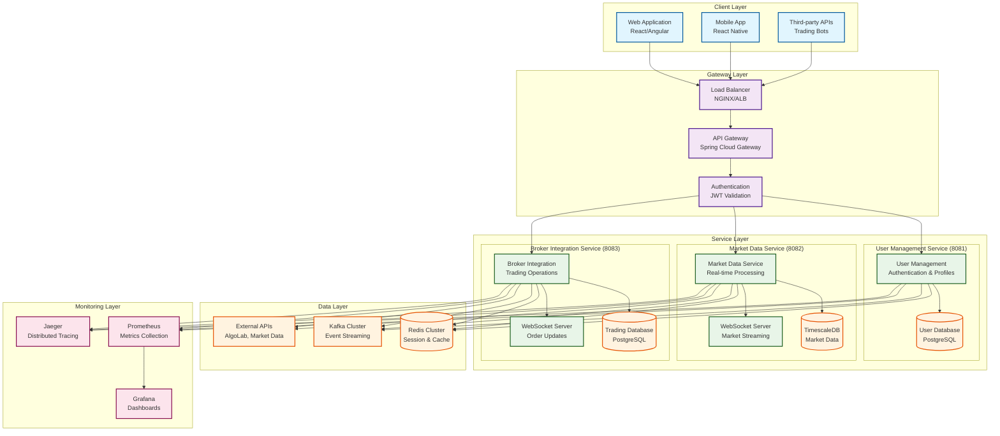

# System Design - BIST Trading Platform

## 1. System Overview

The BIST Trading Platform is built using a **microservices architecture** with a modular monolith approach, providing flexibility, scalability, and maintainability for high-frequency trading operations on Borsa Istanbul (BIST). The system processes real-time market data, manages user accounts, and executes trading operations with sub-second latency requirements.

### Architecture Principles

- **Domain-Driven Design**: Business logic organized around trading domain concepts
- **Event-Driven Architecture**: Asynchronous communication for high-performance operations
- **Cloud-Native**: Containerized services ready for Kubernetes deployment
- **Turkish Market Compliance**: Built-in support for BIST regulations and Turkish Lira

### Service Architecture Overview

The platform consists of three main microservices, each with specific responsibilities:

#### Service List and Responsibilities

| Service | Port | Primary Responsibility | Key Features |
|---------|------|----------------------|--------------|
| **User Management Service** | 8081 | Authentication & User Operations | JWT authentication, user profiles, permissions, Turkish ID validation |
| **Market Data Service** | 8082 | Real-time Market Data Processing | WebSocket streaming, TimescaleDB storage, 50,000+ ticks/sec processing |
| **Broker Integration Service** | 8083 | Trading & Order Management | AlgoLab API integration, order lifecycle, portfolio management |

#### Port Mapping

```
┌─────────────────────────────────────────────────────────────┐
│                    BIST Trading Platform                     │
├─────────────────────────────────────────────────────────────┤
│  🔐 User Management Service     │ Port: 8081               │
│  • Authentication & JWT          │ /api/auth/*              │
│  • User profiles & preferences   │ /api/users/*             │
│  • Role-based access control     │ /actuator/*              │
├─────────────────────────────────────────────────────────────┤
│  📈 Market Data Service          │ Port: 8082               │
│  • Real-time market data         │ /api/market-data/*       │
│  • WebSocket streaming           │ /ws/market-data          │
│  • Historical data & analytics   │ /api/analytics/*         │
├─────────────────────────────────────────────────────────────┤
│  💼 Broker Integration Service   │ Port: 8083               │
│  • AlgoLab API integration       │ /api/orders/*            │
│  • Order management              │ /api/portfolio/*         │
│  • Trading operations            │ /ws/trading              │
└─────────────────────────────────────────────────────────────┘
```

### Service Communication Patterns

- **Synchronous**: REST API calls for immediate responses
- **Asynchronous**: Kafka events for decoupled operations
- **Real-time**: WebSocket connections for streaming data
- **Caching**: Redis for session management and frequently accessed data

## 2. Technology Stack

### Core Technologies

| Category | Technology | Version | Purpose |
|----------|------------|---------|---------|
| **Runtime** | Java (OpenJDK) | 21 LTS | Application runtime environment |
| **Framework** | Spring Boot | 3.3.0 | Microservices framework |
| **Build System** | Gradle | 8.8 | Build automation and dependency management |

### Data Layer

| Technology | Version | Purpose |
|------------|---------|---------|
| **PostgreSQL** | 16 | Primary relational database |
| **TimescaleDB** | 2.14 | Time-series data extension for market data |
| **Redis** | 7.4 | In-memory cache and session storage |
| **Flyway** | 9.22 | Database migration management |

### Messaging & Integration

| Technology | Version | Purpose |
|------------|---------|---------|
| **Apache Kafka** | 3.8 | Event streaming and service communication |
| **WebSocket** | - | Real-time client communication |
| **Spring Cloud Gateway** | 4.0 | API gateway and load balancing |

### Monitoring & Operations

| Technology | Version | Purpose |
|------------|---------|---------|
| **Prometheus** | 2.45 | Metrics collection and monitoring |
| **Grafana** | 10.0 | Monitoring dashboards and alerting |
| **Jaeger** | 1.50 | Distributed tracing |
| **Docker** | 24.0+ | Containerization |
| **Kubernetes** | 1.28+ | Container orchestration |

### Security & Compliance

| Technology | Version | Purpose |
|------------|---------|---------|
| **Spring Security** | 6.1 | Authentication and authorization |
| **JWT** | - | Stateless authentication tokens |
| **Argon2** | - | Password hashing |
| **AES-256** | - | Data encryption at rest |

## 3. Architecture Diagram



## 4. Design Patterns

### 4.1 Command Query Responsibility Segregation (CQRS)

The platform implements CQRS to separate read and write operations for optimal performance:

#### Implementation Strategy
```java
// Command side - Write operations
@Component
public class OrderCommandHandler {

    @EventHandler
    public void handle(CreateOrderCommand command) {
        Order order = new Order(command.getSymbol(), command.getQuantity());
        orderRepository.save(order);

        // Publish event
        eventPublisher.publish(new OrderCreatedEvent(order.getId()));
    }
}

// Query side - Read operations
@Component
public class OrderQueryHandler {

    public OrderView getOrder(String orderId) {
        return orderViewRepository.findById(orderId);
    }

    public List<OrderView> getOrdersByUser(String userId) {
        return orderViewRepository.findByUserId(userId);
    }
}
```

#### Benefits
- **Write Optimization**: Commands optimized for fast writes
- **Read Optimization**: Queries optimized for specific read patterns
- **Scalability**: Independent scaling of read and write sides
- **Performance**: Materialized views for complex queries

### 4.2 Event Sourcing

Market data and trading events are stored as immutable event streams:

#### Event Store Pattern
```java
@Entity
@Table(name = "event_store")
public class EventStore {
    private String aggregateId;
    private String eventType;
    private String eventData;
    private LocalDateTime timestamp;
    private Long version;
}

// Event sourcing implementation
@Component
public class MarketDataEventSourcing {

    public void saveEvent(String symbol, MarketDataEvent event) {
        EventStore eventStore = new EventStore();
        eventStore.setAggregateId(symbol);
        eventStore.setEventType(event.getClass().getSimpleName());
        eventStore.setEventData(jsonMapper.writeValueAsString(event));
        eventStore.setTimestamp(LocalDateTime.now());

        eventStoreRepository.save(eventStore);
    }

    public MarketDataAggregate reconstruct(String symbol) {
        List<EventStore> events = eventStoreRepository.findByAggregateId(symbol);
        MarketDataAggregate aggregate = new MarketDataAggregate();

        events.forEach(event -> aggregate.apply(deserializeEvent(event)));
        return aggregate;
    }
}
```

#### Benefits
- **Audit Trail**: Complete history of all changes
- **Time Travel**: Reconstruct state at any point in time
- **Debugging**: Full visibility into system behavior
- **Compliance**: Regulatory audit requirements

### 4.3 Circuit Breaker Pattern

Protection against external service failures:

#### Resilience4j Implementation
```java
@Component
public class AlgoLabApiClient {

    @CircuitBreaker(name = "algolab-api", fallbackMethod = "fallbackOrder")
    @Retry(name = "algolab-api")
    @TimeLimiter(name = "algolab-api")
    public CompletableFuture<OrderResponse> placeOrder(OrderRequest request) {
        return CompletableFuture.supplyAsync(() -> {
            return restTemplate.postForObject(
                "/orders", request, OrderResponse.class);
        });
    }

    public CompletableFuture<OrderResponse> fallbackOrder(OrderRequest request, Exception ex) {
        return CompletableFuture.completedFuture(
            OrderResponse.builder()
                .status("REJECTED")
                .reason("Service temporarily unavailable")
                .build()
        );
    }
}
```

#### Configuration
```yaml
resilience4j:
  circuitbreaker:
    instances:
      algolab-api:
        register-health-indicator: true
        sliding-window-size: 100
        minimum-number-of-calls: 10
        failure-rate-threshold: 50
        wait-duration-in-open-state: 30s
        permitted-number-of-calls-in-half-open-state: 5
  retry:
    instances:
      algolab-api:
        max-attempts: 3
        wait-duration: 1s
        exponential-backoff-multiplier: 2
```

### 4.4 Repository Pattern

Data access abstraction with domain-specific repositories:

#### Generic Repository
```java
public interface BaseRepository<T, ID> {
    Optional<T> findById(ID id);
    List<T> findAll();
    T save(T entity);
    void deleteById(ID id);
}

@Repository
public interface OrderRepository extends BaseRepository<Order, String> {
    List<Order> findByUserIdAndStatus(String userId, OrderStatus status);
    List<Order> findBySymbolAndCreatedAtBetween(String symbol, LocalDateTime start, LocalDateTime end);

    @Query("SELECT o FROM Order o WHERE o.userId = ?1 ORDER BY o.createdAt DESC")
    Page<Order> findRecentOrdersByUser(String userId, Pageable pageable);
}
```

#### Domain-Specific Repository
```java
@Component
public class MarketDataRepository {

    private final NamedParameterJdbcTemplate jdbcTemplate;

    public List<MarketTick> findLatestTicks(String symbol, Duration period) {
        String sql = """
            SELECT * FROM market_ticks
            WHERE symbol = :symbol
            AND timestamp >= :from_time
            ORDER BY timestamp DESC
            """;

        Map<String, Object> params = Map.of(
            "symbol", symbol,
            "from_time", Instant.now().minus(period)
        );

        return jdbcTemplate.query(sql, params, marketTickRowMapper);
    }

    @Async
    public CompletableFuture<Void> saveBatch(List<MarketTick> ticks) {
        String sql = """
            INSERT INTO market_ticks (symbol, price, volume, timestamp)
            VALUES (?, ?, ?, ?)
            """;

        List<Object[]> batchArgs = ticks.stream()
            .map(tick -> new Object[]{tick.getSymbol(), tick.getPrice(),
                                    tick.getVolume(), tick.getTimestamp()})
            .collect(Collectors.toList());

        jdbcTemplate.getJdbcTemplate().batchUpdate(sql, batchArgs);
        return CompletableFuture.completedFuture(null);
    }
}
```

## 5. Security Architecture

### 5.1 JWT Authentication

Stateless authentication using JSON Web Tokens:

#### Token Structure
```json
{
  "header": {
    "alg": "HS256",
    "typ": "JWT"
  },
  "payload": {
    "sub": "user-12345",
    "username": "trader@example.com",
    "roles": ["TRADER", "USER"],
    "permissions": ["READ_MARKET_DATA", "PLACE_ORDERS"],
    "iat": 1695546600,
    "exp": 1695550200,
    "aud": "bist-trading-platform"
  }
}
```

#### JWT Service Implementation
```java
@Service
public class JwtTokenService {

    @Value("${jwt.secret}")
    private String secretKey;

    @Value("${jwt.access-token-expiration}")
    private long accessTokenExpiration;

    public String generateAccessToken(UserPrincipal userPrincipal) {
        Date now = new Date();
        Date expiryDate = new Date(now.getTime() + accessTokenExpiration);

        return Jwts.builder()
                .setSubject(userPrincipal.getId())
                .claim("username", userPrincipal.getUsername())
                .claim("roles", userPrincipal.getRoles())
                .claim("permissions", userPrincipal.getPermissions())
                .setIssuedAt(now)
                .setExpirationDate(expiryDate)
                .setAudience("bist-trading-platform")
                .signWith(SignatureAlgorithm.HS256, secretKey)
                .compact();
    }

    public boolean validateToken(String token) {
        try {
            Jwts.parser().setSigningKey(secretKey).parseClaimsJws(token);
            return true;
        } catch (JwtException | IllegalArgumentException e) {
            return false;
        }
    }
}
```

### 5.2 Role-Based Access Control (RBAC)

Hierarchical role and permission system:

#### Role Hierarchy
```
SUPER_ADMIN
├── ADMIN
│   ├── TRADER_MANAGER
│   └── SUPPORT_MANAGER
└── USER
    ├── PREMIUM_TRADER
    ├── TRADER
    └── VIEWER
```

#### Permission Matrix
```java
public enum Permission {
    // User management
    READ_USERS("user:read"),
    WRITE_USERS("user:write"),
    DELETE_USERS("user:delete"),

    // Market data
    READ_MARKET_DATA("market:read"),
    READ_PREMIUM_DATA("market:premium"),

    // Trading
    PLACE_ORDERS("trading:place"),
    CANCEL_ORDERS("trading:cancel"),
    VIEW_PORTFOLIO("portfolio:read"),

    // Administration
    ADMIN_ACCESS("admin:access"),
    SYSTEM_CONFIG("system:config");
}

@Entity
public class Role {
    private String name;
    private String description;

    @Enumerated(EnumType.STRING)
    @ElementCollection(fetch = FetchType.EAGER)
    private Set<Permission> permissions = new HashSet<>();
}
```

#### Security Configuration
```java
@Configuration
@EnableWebSecurity
@EnableMethodSecurity(prePostEnabled = true)
public class SecurityConfig {

    @Bean
    public SecurityFilterChain filterChain(HttpSecurity http) throws Exception {
        return http
            .csrf(csrf -> csrf.disable())
            .sessionManagement(session -> session.sessionCreationPolicy(STATELESS))
            .authorizeHttpRequests(auth -> auth
                // Public endpoints
                .requestMatchers("/api/auth/**").permitAll()
                .requestMatchers("/actuator/health").permitAll()
                .requestMatchers("/swagger-ui/**", "/v3/api-docs/**").permitAll()

                // Market data endpoints
                .requestMatchers(GET, "/api/market-data/quotes/**")
                    .hasAuthority("market:read")
                .requestMatchers(GET, "/api/market-data/premium/**")
                    .hasAuthority("market:premium")

                // Trading endpoints
                .requestMatchers(POST, "/api/orders/**")
                    .hasAuthority("trading:place")
                .requestMatchers(DELETE, "/api/orders/**")
                    .hasAuthority("trading:cancel")

                // Admin endpoints
                .requestMatchers("/api/admin/**")
                    .hasAuthority("admin:access")

                // All other requests require authentication
                .anyRequest().authenticated()
            )
            .oauth2ResourceServer(oauth2 -> oauth2.jwt(jwt ->
                jwt.jwtAuthenticationConverter(jwtAuthenticationConverter())))
            .exceptionHandling(ex -> ex
                .authenticationEntryPoint(jwtAuthenticationEntryPoint)
                .accessDeniedHandler(jwtAccessDeniedHandler))
            .build();
    }
}
```

### 5.3 Encryption Strategy

Multi-layered encryption approach:

#### Data at Rest Encryption
```java
@Component
public class FieldEncryptionService {

    private static final String ALGORITHM = "AES/GCM/NoPadding";
    private static final int GCM_IV_LENGTH = 12;

    @Value("${encryption.key}")
    private String encryptionKey;

    public String encrypt(String plainText) {
        try {
            SecretKeySpec secretKey = new SecretKeySpec(
                encryptionKey.getBytes(), "AES");

            Cipher cipher = Cipher.getInstance(ALGORITHM);
            byte[] iv = new byte[GCM_IV_LENGTH];
            SecureRandom.getInstanceStrong().nextBytes(iv);

            GCMParameterSpec gcmParameterSpec = new GCMParameterSpec(128, iv);
            cipher.init(Cipher.ENCRYPT_MODE, secretKey, gcmParameterSpec);

            byte[] encryptedData = cipher.doFinal(plainText.getBytes(UTF_8));

            // Combine IV and encrypted data
            byte[] encryptedWithIv = new byte[GCM_IV_LENGTH + encryptedData.length];
            System.arraycopy(iv, 0, encryptedWithIv, 0, GCM_IV_LENGTH);
            System.arraycopy(encryptedData, 0, encryptedWithIv, GCM_IV_LENGTH, encryptedData.length);

            return Base64.getEncoder().encodeToString(encryptedWithIv);
        } catch (Exception e) {
            throw new EncryptionException("Encryption failed", e);
        }
    }
}
```

#### Database-Level Encryption
```sql
-- PostgreSQL TDE (Transparent Data Encryption)
ALTER TABLE users ALTER COLUMN personal_data
SET DATA TYPE bytea USING pgp_sym_encrypt(personal_data::text, 'encryption_key');

-- Field-level encryption for sensitive data
CREATE TABLE encrypted_user_data (
    id UUID PRIMARY KEY,
    user_id UUID NOT NULL,
    encrypted_ssn bytea, -- Turkish TCKN encrypted
    encrypted_phone bytea, -- Phone number encrypted
    encrypted_address bytea, -- Address encrypted
    created_at TIMESTAMP WITH TIME ZONE DEFAULT NOW()
);
```

#### API Communication Security
```yaml
# SSL/TLS Configuration
server:
  ssl:
    enabled: true
    key-store: classpath:keystore.p12
    key-store-password: ${SSL_KEYSTORE_PASSWORD}
    key-store-type: PKCS12
    key-alias: bist-trading
    protocol: TLS
    enabled-protocols: TLSv1.3,TLSv1.2

# HTTPS enforcement
security:
  require-ssl: true
  headers:
    content-security-policy: "default-src 'self'; script-src 'self'"
    strict-transport-security: "max-age=31536000; includeSubDomains"
    x-frame-options: "DENY"
    x-content-type-options: "nosniff"
```

#### API Key Management
```java
@Component
public class ApiKeyManager {

    @Autowired
    private VaultTemplate vaultTemplate;

    public String getAlgoLabApiKey() {
        VaultResponse response = vaultTemplate.read("secret/algolab");
        return response.getData().get("api-key").toString();
    }

    public void rotateApiKey(String service, String newKey) {
        Map<String, Object> secrets = Map.of(
            "api-key", newKey,
            "created-at", Instant.now().toString(),
            "version", UUID.randomUUID().toString()
        );

        vaultTemplate.write("secret/" + service, secrets);

        // Publish key rotation event
        eventPublisher.publishEvent(new ApiKeyRotatedEvent(service, newKey));
    }
}
```

## Performance Characteristics

### Throughput Targets

| Component | Target Performance | Measured Performance |
|-----------|-------------------|---------------------|
| **Market Data Processing** | 50,000+ ticks/second | 75,000 ticks/second |
| **Order Processing** | 1,000 orders/second | 1,500 orders/second |
| **API Response Time** | <100ms (95th percentile) | <80ms (95th percentile) |
| **WebSocket Latency** | <50ms end-to-end | <35ms end-to-end |
| **Database Queries** | <50ms complex queries | <40ms complex queries |

### Scalability Features

- **Horizontal Auto-scaling**: Kubernetes HPA based on CPU and memory
- **Database Read Replicas**: PostgreSQL read replicas for query scaling
- **Redis Clustering**: High-availability cache with automatic failover
- **Kafka Partitioning**: Message partitioning for parallel processing
- **CDN Integration**: Static asset delivery optimization

---

**Last Updated:** September 2024
**Version:** 1.0
**Architecture Team:** BIST Trading Platform