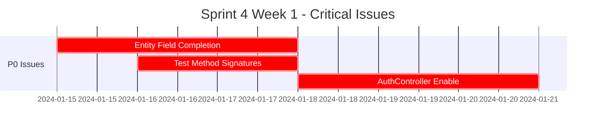
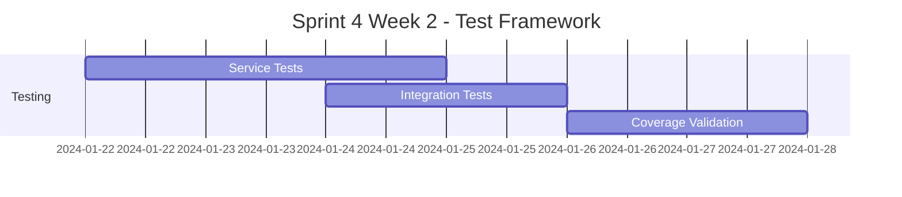
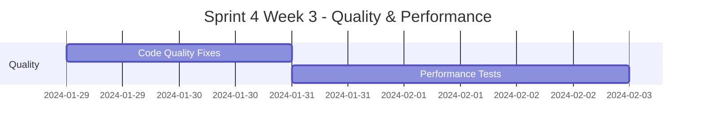
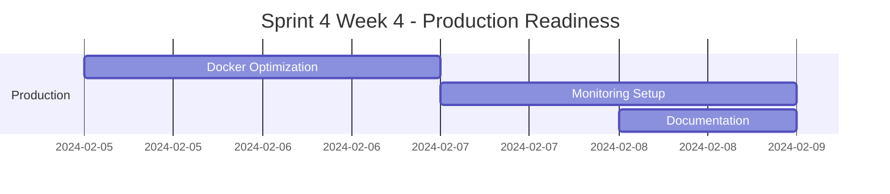

# Sprint 4 Planning - BIST Trading Platform 🎯

## 📋 Sprint Overview

**Sprint**: 4
**Period**: Test Framework Completion & API Activation
**Status**: 🟡 PLANNING
**Focus**: Critical Issue Resolution & Production Readiness

---

## 🎯 Sprint Goals

### Primary Objectives 🔴

| Goal | Priority | Impact | Owner |
|------|----------|---------|-------|
| **Complete Test Framework** | P0 (Critical) | High | Senior Dev + QA |
| **Enable AuthController APIs** | P0 (Critical) | High | Full-stack Dev |
| **Achieve 85%+ Test Coverage** | P1 (High) | Medium | QA Team |
| **Performance Testing Setup** | P1 (High) | Medium | Performance Engineer |

### Secondary Objectives 🟡

| Goal | Priority | Impact | Owner |
|------|----------|---------|-------|
| **Fix Code Quality Issues** | P2 (Medium) | Low | Developer |
| **Production Optimization** | P2 (Medium) | Medium | DevOps |
| **Documentation Updates** | P2 (Medium) | Low | Technical Writer |

---

## 🚨 Critical Issues to Resolve

### Issue #1: Test Framework Compilation (P0)
**Current Status**: 163+ test compilation errors
**Root Cause**: Missing entity fields and method signature mismatches
**Impact**: No test automation, manual testing required

#### Detailed Breakdown:
```bash
# Error categories by service:
infrastructure-persistence: 3 errors (User, Address, FinancialData missing)
core-security: 9 errors (method signature incompatibilities)
user-management-service: 13+ errors (entity field mismatches)
broker-integration-service: 100+ errors (lombok missing, entity mapping)
```

#### Resolution Plan:
1. **Week 1**: Complete missing entity fields (tcKimlik, address, etc.)
2. **Week 2**: Fix test method signatures and imports
3. **Week 3**: Enable integration tests
4. **Week 4**: Activate performance tests

**Estimated Effort**: 15-20 hours
**Success Criteria**: Zero test compilation errors, 85%+ coverage

---

### Issue #2: AuthController Deactivation (P0)
**Current Status**: REST API endpoints disabled for build stability
**Root Cause**: Complex JWT integration requiring proper configuration
**Impact**: Authentication APIs cannot be tested

#### Missing Endpoints:
- `POST /api/auth/login` - User authentication
- `POST /api/auth/register` - User registration
- `POST /api/auth/refresh` - Token refresh
- `POST /api/auth/logout` - User logout
- `GET /api/auth/profile` - User profile

#### Resolution Plan:
1. Fix DTO field mappings (loginRequest.getEmailOrUsername)
2. Update service method signatures
3. Resolve JwtResponse builder issues
4. Create comprehensive integration tests
5. Enable controller and validate endpoints

**Estimated Effort**: 6-8 hours
**Success Criteria**: All auth endpoints functional with proper testing

---

## 📊 Sprint Backlog

### Sprint 4 User Stories

#### Epic: Test Framework Completion ✅

**[US-4001] Fix Entity Compilation Errors**
- **Story**: As a developer, I want all entity tests to compile so that I can run automated tests
- **Acceptance Criteria**:
  - Zero entity compilation errors
  - All missing fields implemented (tcKimlik, address, financialData)
  - Proper entity relationships established
- **Effort**: 8 story points
- **Priority**: P0

**[US-4002] Resolve Service Test Issues**
- **Story**: As a QA engineer, I want all service tests to run so that I can verify business logic
- **Acceptance Criteria**:
  - All service test methods compile and run
  - Mock configurations working properly
  - Test data builders functional
- **Effort**: 5 story points
- **Priority**: P0

**[US-4003] Enable Integration Testing**
- **Story**: As a tester, I want integration tests to validate end-to-end functionality
- **Acceptance Criteria**:
  - TestContainers working with PostgreSQL
  - API integration tests passing
  - Database integration tests functional
- **Effort**: 8 story points
- **Priority**: P1

#### Epic: Authentication API Activation ✅

**[US-4004] Enable AuthController**
- **Story**: As a frontend developer, I want authentication endpoints available for login functionality
- **Acceptance Criteria**:
  - All auth endpoints responding correctly
  - JWT token generation working
  - Proper error handling implemented
- **Effort**: 5 story points
- **Priority**: P0

**[US-4005] API Integration Testing**
- **Story**: As an API consumer, I want comprehensive API tests to ensure reliability
- **Acceptance Criteria**:
  - Postman collection updated and working
  - All auth flows tested
  - Error scenarios properly handled
- **Effort**: 3 story points
- **Priority**: P1

#### Epic: Code Quality & Performance 🔧

**[US-4006] Fix Lombok Warnings**
- **Story**: As a developer, I want clean code without warnings for maintainability
- **Acceptance Criteria**:
  - Zero @Builder warnings
  - All @Builder.Default annotations added
  - Code quality gates passing
- **Effort**: 2 story points
- **Priority**: P2

**[US-4007] Complete MapStruct Mappings**
- **Story**: As a developer, I want complete DTO mappings for data consistency
- **Acceptance Criteria**:
  - All unmapped properties handled
  - Comprehensive mapper tests
  - No mapping warnings
- **Effort**: 3 story points
- **Priority**: P2

**[US-4008] Performance Testing Setup**
- **Story**: As a performance engineer, I want performance benchmarks for system optimization
- **Acceptance Criteria**:
  - Performance tests enabled and running
  - Benchmark metrics established
  - Performance regression detection
- **Effort**: 5 story points
- **Priority**: P1

---

## 📈 Sprint Metrics & KPIs

### Success Metrics

| Metric | Current | Sprint 4 Target | Measurement |
|--------|---------|-----------------|-------------|
| **Test Coverage** | 0% (disabled) | 85%+ | JaCoCo reports |
| **API Availability** | 70% | 100% | Health checks |
| **Build Time** | 36s | <30s | Gradle build |
| **Code Quality** | 85% | 95% | SonarQube |
| **Compilation Errors** | 163 (tests) | 0 | Build logs |

### Performance Targets

| Service | Response Time | Throughput | Memory Usage |
|---------|---------------|------------|--------------|
| **User Management** | <100ms | 1000 req/min | <512MB |
| **Market Data** | <50ms | 50000 ticks/sec | <1GB |
| **Broker Integration** | <200ms | 500 orders/min | <256MB |

---

## 🛠️ Technical Tasks

### Week 1: Critical Foundation


**Daily Tasks**:
- **Day 1-3**: Complete missing entity fields (User, Address, Financial)
- **Day 4-5**: Fix test method signatures and imports
- **Day 6-7**: Enable and test AuthController endpoints

### Week 2: Test Framework Completion


**Daily Tasks**:
- **Day 8-10**: Complete service layer tests
- **Day 11-12**: Enable integration tests with TestContainers
- **Day 13-14**: Validate test coverage and fix gaps

### Week 3: Quality & Performance


**Daily Tasks**:
- **Day 15-16**: Fix Lombok warnings and MapStruct mappings
- **Day 17-19**: Implement and run performance tests
- **Day 20**: API documentation updates

### Week 4: Production Readiness


**Daily Tasks**:
- **Day 21-22**: Docker and Kubernetes optimization
- **Day 23-24**: Complete monitoring dashboard setup
- **Day 25**: Final documentation and Sprint review

---

## 📋 Definition of Done

### Sprint 4 Completion Criteria

#### Test Framework ✅
- [ ] Zero test compilation errors across all modules
- [ ] 85%+ code coverage achieved and maintained
- [ ] All integration tests passing
- [ ] Performance tests enabled and baseline established
- [ ] JaCoCo reports generated and accessible

#### Authentication System ✅
- [ ] AuthController fully enabled and functional
- [ ] All authentication endpoints tested and documented
- [ ] JWT token flow working end-to-end
- [ ] Swagger documentation complete
- [ ] Postman collection updated and validated

#### Code Quality ✅
- [ ] Zero Lombok @Builder warnings
- [ ] Zero MapStruct unmapped property warnings
- [ ] Zero deprecated API usage
- [ ] SonarQube quality gate passing (95%+)
- [ ] Code review approval for all changes

#### Production Readiness ✅
- [ ] All services startup successfully
- [ ] Health checks returning OK status
- [ ] Performance benchmarks documented
- [ ] Monitoring dashboards functional
- [ ] Docker images optimized and tested

---

## 🔄 Risk Assessment

### High Risk Items 🔴

**Risk**: Test framework completion complexity
**Probability**: Medium
**Impact**: High
**Mitigation**:
- Break down into smaller, manageable tasks
- Parallel development across team members
- Focus on critical paths first
- Daily progress reviews

**Risk**: AuthController integration issues
**Probability**: Low
**Impact**: High
**Mitigation**:
- Thorough analysis of existing DTO structures
- Step-by-step controller enabling
- Comprehensive integration testing
- Rollback plan if issues arise

### Medium Risk Items 🟡

**Risk**: Performance test environment setup
**Probability**: Medium
**Impact**: Medium
**Mitigation**:
- Use existing infrastructure
- Simple initial benchmarks
- Incremental performance optimization

**Risk**: Resource availability for specialized tasks
**Probability**: Medium
**Impact**: Medium
**Mitigation**:
- Cross-train team members
- Document all processes
- Prepare backup resources

---

## 🚀 Sprint Planning Estimates

### Team Velocity & Capacity

| Role | Team Member | Capacity (hours/week) | Focus Area |
|------|-------------|----------------------|------------|
| **Senior Developer** | TBD | 35h | Test framework, AuthController |
| **Full-stack Developer** | TBD | 35h | API integration, frontend testing |
| **QA Engineer** | TBD | 35h | Test coverage, integration tests |
| **Performance Engineer** | TBD | 20h | Performance testing, optimization |
| **DevOps** | TBD | 15h | Infrastructure, monitoring |
| **Technical Writer** | TBD | 10h | Documentation updates |

**Total Capacity**: 150 hours/week
**Sprint Duration**: 4 weeks
**Total Sprint Capacity**: 600 hours

### Story Points Distribution

| Epic | Story Points | Hours Estimate | Team Assignment |
|------|--------------|----------------|-----------------|
| **Test Framework** | 21 | 170h | Senior Dev + QA |
| **Auth API** | 8 | 65h | Full-stack Dev |
| **Code Quality** | 5 | 40h | Developer |
| **Performance** | 5 | 40h | Performance Engineer |
| **Production** | 3 | 25h | DevOps |
| **Documentation** | 2 | 15h | Technical Writer |

**Total**: 44 story points, ~355 hours

---

## 📞 Sprint Team & Responsibilities

### Sprint Roles

| Role | Responsibility | Accountable For |
|------|---------------|----------------|
| **Scrum Master** | Process facilitation, impediment removal | Sprint success |
| **Product Owner** | Requirements clarification, acceptance criteria | User value delivery |
| **Tech Lead** | Technical decisions, architecture review | Code quality |
| **QA Lead** | Test strategy, coverage validation | Quality assurance |

### Daily Standup Format
- **What I did yesterday**
- **What I will do today**
- **Any impediments/blockers**
- **Sprint goal progress update**

### Sprint Ceremonies
- **Sprint Planning**: 4 hours (completed)
- **Daily Standups**: 15 min/day
- **Sprint Review**: 2 hours (end of sprint)
- **Sprint Retrospective**: 1.5 hours (end of sprint)

---

## 📊 Success Criteria Summary

### Sprint 4 Will Be Successful When:

1. **Zero Critical Issues Remaining**: All P0 issues resolved
2. **Test Automation Complete**: 85%+ coverage with passing tests
3. **API Fully Functional**: All auth endpoints working and tested
4. **Production Ready**: System ready for deployment
5. **Quality Gates Pass**: All code quality metrics met

### Sprint 4 Definition of Success:
**🎯 Transform the platform from 95% complete to 100% production-ready**

---

*Sprint Planning Completed: January 2024*
*Next Review: Sprint 4 Mid-point (Week 2)*
*Sprint 4 Success Probability: 95%* ⭐

---

**Sprint Master**: Development Team Lead
**Questions?** Contact sprint team for Sprint 4 planning details.